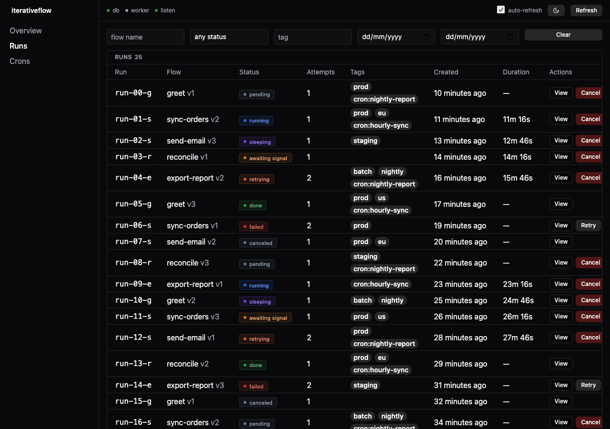
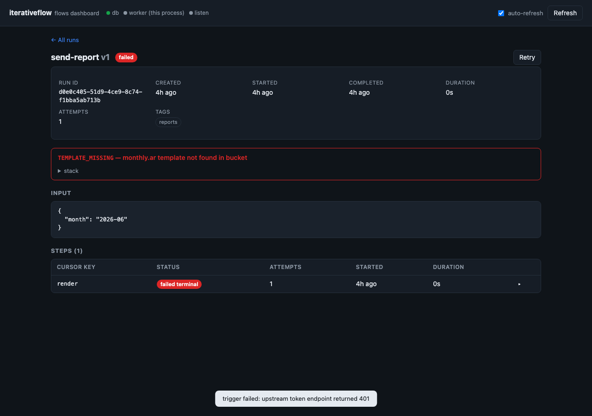
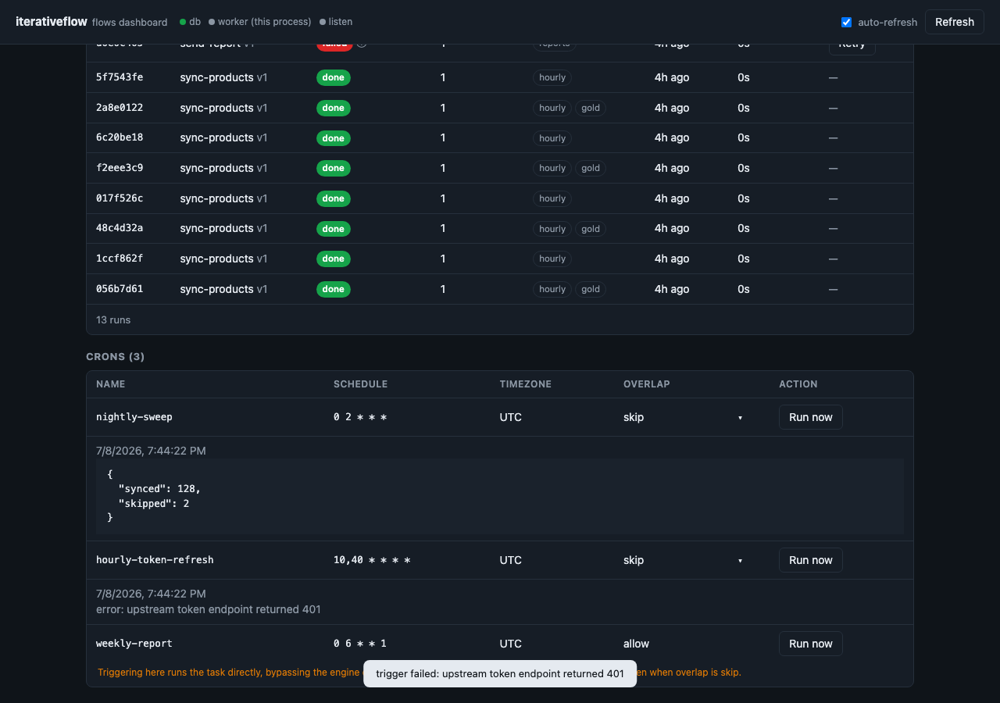

# iterativeflow

## 5.5.2

### Patch Changes

- c3fb2d4: Fix: a run could be orphaned in `retrying` forever. A step retry now records its backoff deadline as a durable `workflow.timers` row (symmetric with `ctx.sleep`), instead of leaving it only in the queue job's `run_at` where the reconciler couldn't see it.

  Previously the retry backoff lived solely in the graphile/pgmq/outbox job. If that wake was lost — the timer fired and the follow-up worker was hard-killed mid-step — the run sat in `retrying` with nothing in `workflow.*` to recover against (observed 30h+). The reconciler's long-standing `retrying + timer due` branch had never matched, because retries never wrote a timer.

  Now:
  - `armRetryTimer` writes/updates one `__retry` timer per run at the backoff deadline; the queue job is demoted to just the wake.
  - A healthy backoff has a future unfired timer → reconciler leaves it alone (no premature retry, at any backoff length). An orphaned retry has an overdue unfired timer → recovered on the same path as a stuck sleep, ~1 min after the missed deadline.
  - The retry timer is fired when the run is claimed back out of `retrying`, so it can't linger and misfire a later `ctx.sleep`.
  - A retrying orphan whose attempts are already exhausted is taken terminal (`failed` / `RUN_ATTEMPTS_EXHAUSTED`) instead of looping.

## 5.5.1

### Patch Changes

- f5f4edf: Fix: a run could be orphaned in `retrying` forever. A step retry now records its backoff deadline as a durable `workflow.timers` row (symmetric with `ctx.sleep`), instead of leaving it only in the queue job's `run_at` where the reconciler couldn't see it.

  Previously the retry backoff lived solely in the graphile/pgmq/outbox job. If that wake was lost — the timer fired and the follow-up worker was hard-killed mid-step — the run sat in `retrying` with nothing in `workflow.*` to recover against (observed 30h+). The reconciler's long-standing `retrying + timer due` branch had never matched, because retries never wrote a timer.

  Now:
  - `armRetryTimer` writes/updates one `__retry` timer per run at the backoff deadline; the queue job is demoted to just the wake.
  - A healthy backoff has a future unfired timer → reconciler leaves it alone (no premature retry, at any backoff length). An orphaned retry has an overdue unfired timer → recovered on the same path as a stuck sleep, ~1 min after the missed deadline.
  - The retry timer is fired when the run is claimed back out of `retrying`, so it can't linger and misfire a later `ctx.sleep`.
  - A retrying orphan whose attempts are already exhausted is taken terminal (`failed` / `RUN_ATTEMPTS_EXHAUSTED`) instead of looping.

## 5.5.0

### Minor Changes

- 4490bac: Add per-call transactional enqueue and atomic batch dispatch.
  - `handle.start(input, { tx })` — pass a `tx` (your `WorkflowDb` transaction handle) and the run-row insert and the queue's add-job run through your transaction instead of the engine's own pool, so the run commits atomically with the rows that create the flow's subject. Nothing appears until you commit, and a rollback discards the run — eliminating both the enqueue-before-commit read race and the commit-then-crash orphan window. Omitting `tx` is unchanged.
  - `handle.startMany(items, { tx? })` — insert and enqueue many runs atomically in a handful of statements (one multi-row insert for runs, one for their started events, one bulk enqueue) instead of one round-trip per run. All-or-nothing; pass `tx` to commit the batch with your own rows. Results are returned in input order, and idempotent duplicates (within a batch or across calls) return the original run.

## 5.4.1

### Patch Changes

- cfa1ebd: fix copy schema regression

## 5.4.0

### Minor Changes

- 2438a76: Add per-call transactional enqueue via `StartOpts.tx`. Pass a `tx` (your `WorkflowDb` transaction handle) to `handle.start(input, { tx })` and the run-row insert and the queue's add-job run through your transaction instead of the engine's own pool — so the run commits atomically with the rows that create the flow's subject. Nothing appears until you commit, and a rollback discards the run, eliminating both the enqueue-before-commit read race and the commit-then-crash orphan window. Omitting `tx` is unchanged.

## 5.3.0

### Minor Changes

- 3559b42: Add `iterativeflow/dashboard` — a mountable operations console for your flows.
  Mount one fetch handler behind your own auth and browse everything the engine
  knows, with no extra services and no runtime dependencies added to your app.

  
  - **Runs** — browse, filter (flow, status, tag, date range), and page through
    every run.
  - **Run detail** — steps, sleeps, signals, and capped input/output payloads in a
    slide-over sheet, with highlighted JSON and copy buttons.
  - **Act on a run** — cancel, retry, or deliver a signal (with a JSON payload) to
    a run that's waiting on one.
  - **Crons** — trigger a cron on demand and see the runs it started.
  - **Overview** — status distribution, recent runs, and active crons at a glance.
  - **Shareable & refresh-safe** — the open run/cron sheet and active filters live
    in the URL, so a reload or a shared link restores exactly what you were looking
    at.

  ```ts
  import { createFlowsDashboard } from "iterativeflow/dashboard";

  const dashboard = createFlowsDashboard({ engine, crons });
  // dashboard.fetch: (req: Request) => Promise<Response> — mount it behind your auth
  ```

  Pass `crons` for the crons view, `jsonCap` to bound payload previews, and
  `theme` to match your app.

  
  

  Thanks [@ramisalem](https://github.com/ramisalem) for kicking this off in #14.

## 5.2.0

### Minor Changes

- 2d16e4c: Pluggable scheduling + serverless adapter (ADR 0003).

  The engine now drives runs through a `Dispatcher` seam, defaulting to the
  resident graphile worker — behavior is unchanged for existing setups. New:
  - `engine.handleRun(runId)` — one stateless claim → replay → suspend cycle, for
    serverless hosts to call per request.
  - `engine.reconcile()` — re-enqueue orphaned runs (the recovery sweep, now
    drivable from a serverless `/cron`).
  - `EngineOpts.dispatcher` and the `Scheduler` / `Dispatcher` interfaces.
  - New `iterativeflow/serverless` subpath: `createOutboxEnqueue` (transactional
    wake outbox), `drainDueWakes`, `drainAndRun`, `createWakeOutboxTable`,
    `createServerlessDispatcher`. Run durable workflows on Vercel / Lambda /
    Cloudflare against your own Postgres — including scale-to-zero databases — with
    state that never leaves your DB. See `docs/serverless.md`.
  - New `iterativeflow/pgmq` subpath: `createPgmqEnqueue`, `drainAndRunPgmq`,
    `createPgmqQueue` — drive the same serverless model over a pgmq queue, gaining
    native visibility-timeout redelivery.

  All additive; no schema change.

## 5.1.0

### Minor Changes

- c37c4c1: Enqueue-only handles from a flow contract.

  A `FlowContract` is the light, body-free identity of a flow — `name`, `version`,
  and input schema. An API process that only starts flows can now import the
  contract (not the flow body) and build a typed `.start` handle from it, so it
  never pulls the body's heavy transitive deps (native addons, etc.) into its
  image.

  Additive — nothing existing changes:
  - `defineContract<I, O>({ name, version, input })` → `FlowContract<I, O>`.
  - `flow(contract)` builder overload — seeds `name`/`version`/`input` and
    constrains `.output(...)` to the contract's output type, so the worker's body
    cannot drift from the enqueue-only callers.
  - `engine.enqueueHandle(contract)` → a typed `FlowHandle` that enqueues but
    registers no body (adds nothing to the worker's task list, per ADR 0001).
  - `engine.enqueue(name, version, input, opts?)` — untyped escape hatch for
    dynamic/codegen callers.

  Composes with per-flow routing: the enqueued run lands under
  `flow:run:<name>@<version>` and only the worker that registered the body claims
  it. `ctx.invoke` already accepts an enqueue-only handle (it reads only
  name/version/input), so a parent can invoke a child it doesn't implement.

## 5.0.0

### Major Changes

- 0c29cac: Per-flow task routing: a worker now claims only the flows it registered.

  Each flow is enqueued under its own graphile-worker task identifier
  (`flow:run:<name>@<version>`) instead of a shared `flow:run`. graphile routes a
  run only to workers whose task list contains that identifier, so splitting
  workers by registered flow finally isolates them — a media worker can no longer
  claim (and fail) a clone job. Mirrors how crons already route per name.

  Breaking:
  - `TxEnqueue`'s signature changed from `(tx, runId, opts?)` to
    `(tx, job: { runId; name; version }, opts?)`. Only affects consumers passing a
    custom `worker.enqueue`; the built-in graphile enqueue is unchanged for callers.
  - The worker's task list is fixed when `engine.listen()` runs, so `engine.register`
    after `listen()` now throws (previously it silently produced runs no worker could
    claim). Register all flows before `listen()`.

## 4.1.0

### Minor Changes

- ccda5c6: Add `engine.retry(runId)` — replay a `failed` run from the step that failed. Memoized `ok` step results are preserved; the `failed_terminal` step row is deleted, the run is reset to `pending` with `attempts=0`, a `resumed` event is recorded, and the run is re-enqueued atomically. Returns a `RetryResult` discriminated by `kind`: `"queued"`, `"missing"`, or `"not_failed"` (with the current status).

  This is **replay**, not restart: a fresh `handle.start(input)` is a brand-new run and re-executes every step. `engine.retry(runId)` resumes the same `runId` and skips work already done.

### Patch Changes

- d0fcf0d: Fix `engine.status()` and `engine.listRuns()` rows showing every column as `unknown` on the consumer side. The root cause: `RunRow` (and friends) were `typeof runs.$inferSelect`, which carries drizzle's column brand into the bundled `.d.ts`. The bundle re-renders drizzle under a vendored namespace, so a consumer's drizzle copy can't dereference the brand — every per-column inference collapses to `unknown`.

  `RunRow`, `StepRow`, `TimerRow`, `SignalRow`, `EventRow` are now hand-written interfaces with concrete field types (`id: string`, `status: RunStatus`, `createdAt: Date`, `error: FlowError | null`, `tags: string[] | null`, jsonb columns as `unknown`, etc.). A compile-time equivalence check pins each interface to drizzle's `$inferSelect` of the runtime table, so a column rename or type change here fails the build instead of drifting.

  No runtime change; structurally identical shapes — consumers just get usable types in `engine.status().run.name` etc. without casts.

## 4.0.0

### Major Changes

- e0c14ad: Stop hiding consequential behavior behind defaults.

  Two defaults silently took actions the developer didn't ask for. Both now hand the decision back:
  - **`StepOpts.retries` defaults to `0`** (was `3`). A step runs once and its failure is terminal unless you opt in with `retries: N`. Previously every step silently retried up to 4× with exponential backoff; you had to write `retries: 0` to get a single run. (Steps re-run on crash recovery regardless, so side-effecting bodies should already be idempotent.)
  - **`engine.listRuns({ limit })` throws when `limit > 500`** instead of silently clamping to 500. Asking for more than the max now surfaces an error rather than truncating the page without a signal.

  Migration: if you relied on automatic step retries, add `retries: 3` (or your preferred count) to those `ctx.step(...)` / `.step(...)` calls. If you passed `listRuns({ limit })` above 500, lower it to ≤ 500.

- e0c14ad: Group `EngineOpts` into descriptive config blocks.

  The flat options bag is replaced with four nested groups so related settings live together and each group's defaults are documented on the hover. Switchable subsystems (`reconciler`, `retention`) take `false | { … }`; always-on tuning (`worker`, `limits`) takes `{ … }`. New: `reconciler.schedule` lets you change the sweep cadence (previously hardcoded to every minute).

  Migration:

  | Before (v3)               | After (v4)                    |
  | ------------------------- | ----------------------------- |
  | `workerSchema`            | `worker.schema`               |
  | `concurrency`             | `worker.concurrency`          |
  | `pollInterval`            | `worker.pollInterval`         |
  | `enqueue`                 | `worker.enqueue`              |
  | `disableReconciler: true` | `reconciler: false`           |
  | `reconcilerGraceMs`       | `reconciler.graceMs`          |
  | `runningStuckMs`          | `reconciler.runningStuckMs`   |
  | `maxRunAttempts`          | `limits.maxRunAttempts`       |
  | `defaultStepTimeoutMs`    | `limits.defaultStepTimeoutMs` |

  `retention` and `limits` (size caps) keep their fields; `limits` now also holds `maxRunAttempts` and `defaultStepTimeoutMs`.

  ```ts
  // before
  createEngine({
    db,
    pool,
    workerSchema: "gw",
    concurrency: 10,
    disableReconciler: true,
    maxRunAttempts: 50,
  });

  // after
  createEngine({
    db,
    pool,
    worker: { schema: "gw", concurrency: 10 },
    reconciler: false,
    limits: { maxRunAttempts: 50 },
  });
  ```

### Minor Changes

- e0c14ad: Export `isSuspend` and `FlowSuspend` from the public API.

  `ctx.sleep` / `ctx.signal` / `ctx.invoke` park a run by throwing `FlowSuspend`. Because it extends `Error`, a `try/catch` around a `ctx.*` call silently swallows the suspend and the run never parks. These were `@internal`, so consumers had no way to guard. The correct pattern is now expressible:

  ```ts
  try {
    await ctx.signal("approval", { timeout: "24h" });
  } catch (err) {
    if (isSuspend(err)) throw err; // let the run park
    // ...handle real errors
  }
  ```

### Patch Changes

- e0c14ad: Reap orphaned `cron:*` jobs on worker startup.

  When a cron is removed from code, graphile-worker stops scheduling it but already-enqueued `cron:<name>` jobs linger with no task handler — they sit forever, erroring across deploy cutovers. `startGraphileWorker` now runs a best-effort purge after `run()`, completing any `cron:*` job whose task is no longer registered. It never throws, so a reap failure can't block worker startup.

  The cron policy (jitter, overlap, reaping) now lives in its own `cron` module that the graphile adapter drives.

- e0c14ad: Recover runs whose worker crashed mid-execution.

  A run that died while `status = running` could never resume: the reconciler re-enqueued it but left the status `running`, and `claimRun` rejects `running` as "lost" — so the re-enqueued job was skipped forever and the run hung permanently. The reconciler now resets a stuck `running` run to `retrying` before re-enqueuing, so the next claim succeeds. Guarded by the existing `reconciler.runningStuckMs` threshold (default 10 min).

## 3.1.0

### Minor Changes

- f808fa1: `engine.status()` and `engine.listRuns()` now return rows with your drizzle-inferred types instead of `unknown`. `Engine`, `EngineOpts`, `RunDetail`, and `ListRunsPage` are generic over `T extends FlowTables` with a sensible default. Pass `tables` from your generated schema and any custom columns you added flow through end-to-end — without `tables`, the rows reflect the engine's internal table shape.

  Also exports the row types (`RunRow`, `StepRow`, `TimerRow`, `SignalRow`, `EventRow`), `DefaultFlowTables`, and the `Row<T>` helper.

## 3.0.2

### Patch Changes

- 77b0f22: Fix JS `Date` binding in raw `sql\`\``fragments — caused runtime failures on`postgres-js`/`neon-serverless`drivers, which (unlike`node-postgres`) don't natively encode `Date` in positional params when drizzle hasn't propagated column type info.

  Three sites affected:
  - `reconcile.ts` — `${runs.updatedAt} < ${olderThan}` rewritten via drizzle's typed `lt(col, date)` so the column's `timestamptz` encoder runs. The `EXISTS` subqueries (no JS values, only `NOW()`) stay raw.
  - `queries.ts` — cursor tuple compare `(createdAt, id) < (...)` casts the JS-Date param to `::timestamptz` in SQL. Tuple compare can't go through `lt`, so the cast is the cheapest correct fix.
  - `adapters/graphile/index.ts` — `add_job(... run_at => ${opts.runAt} ...)` cast to `::timestamptz` for the same reason. Affected every delayed enqueue (sleeps, retries, `delay` start opt).

  Consumers using postgres-js or neon-serverless no longer need to spin up a separate `node-postgres` handle for the engine's pool.

  A single `ts(date)` helper in `src/util/sql-params.ts` centralizes the cast — every Date param in a raw `sql\`\`` fragment goes through it. Easier to grep for, easier to extend (uuid/bigint/etc.) if the next driver-portability footgun shows up.

- fcc8f99: Three more boot-time footgun warnings + structural cleanup.

  **Warnings** (operator-tunable defaults that silently bite under load):
  - `flow.config.unbounded_step_timeout` — no `defaultStepTimeoutMs` set; a hung step pins a worker slot indefinitely. Set `defaultStepTimeoutMs` (or pass `StepOpts.timeoutMs` on every step).
  - `flow.config.no_retention` — no `retention` configured; `workflow.events` and terminal `workflow.runs` grow forever. Set `EngineOpts.retention` or run your own prune cron.
  - (already shipped last patch) `flow.config.stuck_shorter_than_step_timeout` — reconciler would resurrect a still-running step.

  **Stderr fallback for warnings.** When `EngineOpts.logger` isn't provided, the engine now uses a logger that pipes `warn`/`error` to `process.stderr` (debug/info stay silent). Previously the default was a full noop — boot validators warned into the void. Consumers who genuinely want silence still get it by passing their own no-op logger.

  **Internal restructure.** Extracted `src/engine/internal-crons.ts` (reconciler + retention cron builders) and `src/engine/loggers.ts` (fallback + console presets). `engine.ts` 464 → 413 lines; `createEngine` reads more linearly. Default magic numbers consolidated into named constants, using the existing `toMs("1m")` / `toMs("10m")` duration helpers for self-documenting time values.

- 645bc2a: Boot validator + docs for restart behavior.

  **Validator** — warns at engine boot when `runningStuckMs < defaultStepTimeoutMs`. The mismatch produces a real bug class: a step running between the two bounds is indistinguishable from a crashed process, so the reconciler resurrects it and you get two concurrent attempts of the same run.

  ```ts
  createEngine({
    runningStuckMs: 60_000, // 1 min
    defaultStepTimeoutMs: 30 * 60_000, // 30 min ← BAD: step can outlive stuck threshold
  });
  // warns: flow.config.stuck_shorter_than_step_timeout
  ```

  **Docs** — new "Restart behavior" section in `docs/guide.md` covers:
  - What survives a restart (`running` runs → reconciler; `sleeping` runs → graphile; `awaiting_signal` runs → DB rows + NOTIFY; idempotency keys; cron advisory locks).
  - What doesn't (`handle.result` / `handle.wait` in-process Promise waiters die on crash; caller must retry).
  - At-least-once step semantics — make external calls idempotent.
  - Crash-recovery latency = `runningStuckMs` (default 10 min); tune lower for tighter recovery, but respect the new validator.
  - Multi-instance / rolling deploy safety (FOR UPDATE SKIP LOCKED + cross-instance NOTIFY).

## 3.0.1

### Patch Changes

- c048de0: Fix `db.execute()` result-shape assumption that broke on drivers other than `drizzle-orm/node-postgres`. `invoke-budget` and `schema-version` probes were reading `result.rows[0]`, but `postgres-js` (and some drizzle 1.x driver builds) return the rows array directly — those consumers were getting `undefined.rows` and patching the dist by hand.

  Added a `rowsOf()` helper that handles both shapes and used it at both call sites. `pg_notify` and other fire-and-forget executes are unaffected.

## 3.0.0

### Major Changes

- 30feb15: v3 — codegen + customizable tables (cross-version drizzle safety + naming flexibility).

  ## Why

  Two pain points v3 solves:
  1. **Drizzle cross-version type breakage.** v2 exported table objects typed against drizzle-orm 0.45. Consumers on drizzle-orm 1.0-rc hit TS errors at `db.select().from(runs)` because the embedded `PgTable` shape didn't match their drizzle. v3 ships no drizzle-typed values; consumers generate their own via the CLI and use their drizzle's types throughout.

  2. **No naming flexibility.** v2 hardcoded `workflow.runs`, `workflow.steps`, etc. Consumers couldn't rename tables, change the `pgSchema` name, or add custom columns. v3 lets you customize all of it.

  ## What changed (breaking)
  - **`iterativeflow/schema` subpath export removed.** Previously `import { runs } from "iterativeflow/schema"` worked; now run `npx iterativeflow generate-schema` and import from your own project file.
  - **`iterativeflow/relations` subpath removed** (same reason).
  - **`flowSchema`, `runs`, `steps`, `signals`, `timers`, `events`** are no longer exported anywhere on the public surface. They moved entirely into a generated file the consumer owns.

  ## What's new
  - **`npx iterativeflow generate-schema`** — emits `./iterativeflow-schema.ts` at the project root (override with `--out`). Typed against your `drizzle-orm`, so `db.select().from(flowTables.runs)` works on any drizzle version.
  - **`createEngine({ tables })`** — optional. Pass `flowTables` from your generated file only if you customize (renamed tables, custom `pgSchema` name, added columns the engine should see). The default `createEngine({ db, pool })` works against the unmodified generated file.
  - **`applyFlowSchema(db)` / `dropFlowSchema(db)`** are now re-exported from the main `iterativeflow` entry. Use `applyFlowSchema` to install the workflow tables programmatically without drizzle-kit; it reads the bundled `migrations/0000_init.sql` directly (no `drizzle-kit/api` runtime dependency).

  ## What stayed the same
  - The SQL — `migrations/0000_init.sql` is unchanged. `psql -f node_modules/iterativeflow/migrations/0000_init.sql` still works.
  - Wire-level contracts — `pg_notify` channel names (`flow_terminal`, `flow_progress`), cursor key scheme, replay semantics — all unchanged.
  - Constants and error vocabulary — `RUN_STATUSES`, `STEP_STATUSES`, `EVENT_TYPES`, `FLOW_ERROR_CODES`, the derived `RunStatus`/`StepStatus`/`EventType`/`FlowErrorCode` types, and the `FlowError` interface stay on the main `iterativeflow` entry.

  ## Migration

  ```bash
  # 1. Generate the consumer-side schema file
  npx iterativeflow generate-schema
  # → wrote ./iterativeflow-schema.ts

  # 2. Update your drizzle.config.ts
  #    BEFORE:  schema: [require.resolve("iterativeflow/schema")]
  #    AFTER:   schema: ["./iterativeflow-schema.ts"]

  # 3. Replace any imports from "iterativeflow/schema"
  #    BEFORE:  import { runs } from "iterativeflow/schema"
  #    AFTER:   import { flowTables } from "./iterativeflow-schema"
  #             // then: flowTables.runs

  # 4. If you customize (renamed tables, custom pgSchema, added columns):
  #    pass tables to createEngine:
  #      createEngine({ db, pool, tables: flowTables })
  #    Otherwise nothing to do — `createEngine({ db, pool })` works as-is.
  ```

  Same SQL, same column names by default, same wire shape.

  ## Stability discipline

  `etc/iterativeflow.api.md` (tracked via `npm run api:check`) gates every change to the public surface. The library's public TS is now ORM-type-free — constants, error types, plain interfaces, and the engine's runtime API only.

## 2.0.1

### Patch Changes

- adfaf27: Docs and internal hardening:
  - Rewrote `docs/guide.md` to v2 vocabulary (`signal` not `hook`, `FlowHandle` not `WorkflowHandle`, `engine.listen()` not `engine.start()`, etc.). Multiple v1 names were sitting in published docs after the v2 rename — they're gone now.
  - Fixed a stray `// hook's timeout fired` comment in `README.md`.
  - Added a compiled-docs gate: `scripts/extract-doc-examples.mjs` pulls every ` ```ts ` block from `README.md` + `docs/*.md` into `tests/docs-examples/`, and `npm run docs:check` typechecks them against the local source. Wired into the pre-push hook and CI. Blocks that aren't standalone (signature listings, partial chains) are marked with `<!-- doc-check: skip -->`.
  - Added a replay corpus: `tests/replay-corpus/*.json` are captured suspension-state snapshots (`sleep-suspended`, `signal-suspended`, `completed-run`), and `tests/replay-corpus/corpus.test.ts` re-inserts each one against a fresh pglite and replays via `playRunAttempt` to verify the run reaches the documented terminal state. Regenerate the corpus deliberately via `npm run corpus:capture` when the storage shape changes.

## 2.0.0

### Major Changes

- a248675: Major release — unified vocabulary, child flows, blocking `handle.result()`, `AbortSignal` in steps, paginated `listRuns`, retention auto-pruning, payload caps, metrics, and a richer schema. No backwards-compatible aliases — see migration below.

  ## Breaking changes

  ### Schema

  A `drizzle-kit generate && drizzle-kit migrate` is required.
  - Column rename `step_key` / `hook_key` → **`cursor_key`** across `steps`, `timers`, `events`, `signals`.
  - Table rename `workflow.hooks` → **`workflow.signals`**.
  - New columns on `runs`: `parent_run_id`, `parent_cursor_key`, `tags text[]` (GIN-indexed).
  - Run statuses: `waiting` → **`awaiting_signal`**; new **`retrying`** status (split out from `sleeping`).
  - Event types: `hook_armed` / `hook_resolved` / `hook_timeout` → **`signal_armed`** / **`signal_delivered`** / **`signal_timeout`**.
  - Error codes: `WORKFLOW_HOOK_TIMEOUT` → `SIGNAL_TIMEOUT`; `HOOK_PAYLOAD_INVALID` → `SIGNAL_PAYLOAD_INVALID`; `WORKFLOW_SUSPEND_IN_STEP` → `STEP_INVALID_AWAIT`; `UNKNOWN_WORKFLOW` → `FLOW_UNKNOWN`; `CANCELED` → `RUN_CANCELED`; `NON_DETERMINISTIC` → `REPLAY_NON_DETERMINISTIC`; `INCOMPATIBLE_VERSION` → `REPLAY_INCOMPATIBLE_VERSION`. New: `INVOKE_DEPTH_EXCEEDED`, `INVOKE_FANOUT_EXCEEDED`, `SCHEMA_MISMATCH`.

  The Postgres schema name `workflow` is unchanged.

  ### API
  - `ctx.hook(name)` → `ctx.signal(name)` (and builder `.hook()` → `.signal()`).
  - `engine.start()` → **`engine.listen()`**.
  - `engine.defineWorkflow({ run })` → **`engine.register({ ..., body })`** (or use the builder; both go through `engine.register`).
  - Step functions now receive a structured argument:

    ```ts
    // before
    await ctx.step("fetch", () => httpGet(url));

    // after
    await ctx.step("fetch", ({ input, signal, attempt }) => httpGet(url, { signal }));
    ```

  - `engine.signal(runId, name, payload)` now returns `SignalDeliveryResult` instead of `void`:

    ```ts
    const result = await engine.signal(runId, "approve", { ok: true });
    switch (result.kind) {
      case "delivered":
        break; // the run was awaiting; now resumes
      case "buffered":
        break; // signal arrived first; consumed on arm
      case "duplicate":
        break; // already accepted; idempotent
      case "expired":
        break; // timeout already fired — reject the webhook
    }
    ```

  - Type renames: `WorkflowContext` → `FlowContext`, `WorkflowHandle` → `FlowHandle`, `WorkflowError` → `FlowError`, `WorkflowErrorCode` → `FlowErrorCode`, `WORKFLOW_ERROR_CODES` → `FLOW_ERROR_CODES`, `WorkflowRuntimeError` → `FlowRuntimeError`, `workflowError` → `flowError`, `toWorkflowError` → `toFlowError`, `workflowSchema` → `flowSchema`, `applyWorkflowSchema` → `applyFlowSchema`, `dropWorkflowSchema` → `dropFlowSchema`, `HookOpts` → `SignalOpts`, `HookNode` → `SignalNode`, `WorkflowSuspend` → `FlowSuspend`, `RuntimeWorkflowContext` → `RuntimeFlowContext`, `DefineWorkflowOpts` (`run` field) → `DefineFlowOpts` (`body` field), `SignalResult` → `SignalDeliveryResult`.
  - Source layout: `runtime/graphile.ts` → `adapters/graphile/`; `tracing.ts` → `util/tracing.ts`. Internal task identifier `workflow:run` → `flow:run`.

  ## New features

  ### Child flows — `ctx.invoke`

  ```ts
  const order = engine.register(flow("order").step(...).build());
  const ship = engine.register(flow("ship").step(...).build());

  const fulfill = flow("fulfill")
    .step("validate", ({ input, signal }) => validate(input, { signal }))
    .step("place", async ({ input, ctx }) => {
      const placedOrder = await ctx.invoke(order, input);
      return ctx.invoke(ship, placedOrder);
    })
    .build();
  ```

  Child flows have their own `runId`, attempts, and snapshot. The parent suspends until the child terminates. Cursor-keyed so resumes don't re-spawn the child.

  ### Blocking `handle.result()`

  ```ts
  const { runId } = await handle.start({ userId: "u_1" });
  const output = await handle.result(runId, { timeoutMs: 60_000 });
  ```

  Backed by Postgres `LISTEN flow_terminal` with a row-poll fallback. No more polling `handle.output()` in your code.

  ### `AbortSignal` in step functions

  Wires the configured `timeoutMs` AND `engine.cancel(runId)` to a single `AbortSignal`. Pass it to `fetch`, `pg`, `undici`, OpenAI SDKs.

  ```ts
  .step("call-llm", async ({ input, signal }) => {
    const res = await fetch(url, { signal, body: input });
    return res.json();
  }, { timeoutMs: 30_000 })
  ```

  `engine.cancel(runId)` now aborts the in-flight controller AND guards `markCompleted`/`markFailed` from overwriting the canceled tombstone.

  ### Run listing — `engine.listRuns`

  ```ts
  const page = await engine.listRuns({
    name: "onboard",
    status: ["failed", "awaiting_signal"],
    tag: "tenant:acme",
    since: new Date(Date.now() - 24 * 60 * 60_000),
    limit: 50,
  });
  ```

  Keyset pagination on `(createdAt, id)`. Composes with the new `tags` column (GIN-indexed).

  ```ts
  await handle.start(input, { tags: [`tenant:${tenantId}`, "priority:high"] });
  ```

  ### Retention auto-pruning

  ```ts
  createEngine({
    db,
    pool,
    retention: {
      eventsOlderThan: "30d",
      runsOlderThan: "90d",
      schedule: "0 * * * *", // default hourly
    },
  });
  ```

  ### Payload size caps

  ```ts
  createEngine({
    db,
    pool,
    limits: {
      maxInputBytes: 256 * 1024,
      maxStepResultBytes: 256 * 1024,
      maxSignalPayloadBytes: 64 * 1024,
    },
  });
  ```

  Oversized values throw before they hit the database.

  ### Metrics

  ```ts
  createEngine({
    db,
    pool,
    metrics: {
      runStarted: ({ name }) => counters.runs_started.inc({ name }),
      stepFinished: ({ status, durationMs }) => histograms.step.observe({ status }, durationMs),
      signalDelivered: ({ kind }) => counters.signals.inc({ kind }),
    },
  });
  ```

  All methods are optional; methods you don't supply are no-ops. Available: `runStarted`, `runCompleted`, `runFailed`, `runSuspended`, `stepFinished`, `signalDelivered`, `reconcilerSweep`.

  ### Operational helpers

  ```ts
  const engine = createEngine({ db, pool, logger: consoleLogger() });
  engine.attachShutdownSignals(); // SIGTERM/SIGINT → engine.stop()
  await engine.listen();

  const health = await engine.health(); // { ok, db, worker, startedAt }
  ```

  `logger` is now optional (defaults to a noop logger).

  ### Cron — timezone, overlap, jitter

  ```ts
  engine.defineCron({
    name: "nightly-report",
    schedule: "0 2 * * *",
    timezone: "America/Los_Angeles",
    overlap: "skip", // default — prevents concurrent runs via PG advisory lock
    jitterMs: 60_000,
    run: async () => generateReport(),
  });
  ```

  ### Hard ceilings

  ```ts
  createEngine({
    db,
    pool,
    maxRunAttempts: 100, // hard ceiling — stops poison-pill loops
    defaultStepTimeoutMs: 30 * 60_000, // fallback when StepOpts.timeoutMs is not set
  });
  ```

  Exhausted runs fail with `RUN_ATTEMPTS_EXHAUSTED`.

  ### Schema fingerprint at boot

  The engine reads `information_schema` for marker columns on first `listen()` / first `handle.start()` and throws `SCHEMA_MISMATCH` if the schema is at the wrong version. The error message tells you exactly which migration to run.

  ```ts
  // If the schema is at v1 (or not applied):
  // Error: SCHEMA_MISMATCH: schema is at v1, engine expects v2 — run `drizzle-kit generate && drizzle-kit migrate`
  ```

  Eliminates the rolling-deploy class of "engine code expects v2 schema, DB is still v1, runs silently fail" failures.

  ### Hard caps on `ctx.invoke`

  `limits.maxInvokeDepth` (default `10`) and `limits.maxChildrenPerRun` (default `1000`) stop accidental infinite recursion and runaway fan-out:

  ```ts
  createEngine({
    db,
    pool,
    limits: {
      maxInvokeDepth: 10, // root = 1; throws INVOKE_DEPTH_EXCEEDED if exceeded
      maxChildrenPerRun: 1000, // throws INVOKE_FANOUT_EXCEEDED if exceeded
    },
  });
  ```

  ### Boot-time validators

  `createEngine` now fails fast on operator misconfiguration:
  - **`logger`** — missing `debug` / `info` / `warn` / `error` throws on construction.
  - **`retention.runsOlderThan` / `eventsOlderThan`** — invalid durations throw on construction instead of failing at the first cron tick.
  - **`pool.options.max` vs `concurrency`** — when `concurrency > pool.max`, the engine emits `logger.warn("flow.config.pool_too_small", { concurrency, poolMax })`.
  - **`defineCron({ schedule })`** — invalid cron patterns throw at registration time, not at `listen()`.

  ### Bundle size budget

  `npm run size:check` sums the gzipped sizes of `dist/*.js` and fails CI if the total exceeds the configured budget (default `320 kB`, override via `SIZE_BUDGET_KB`). Current footprint is ~22 kB gzipped, so the budget is roomy on purpose — it's a regression guard, not a limit.

  ### Resilient LISTEN reconnect

  The Postgres `LISTEN` subscription that powers `handle.result()` / `handle.wait()` now reconnects on its own. Previously a single connection error would permanently degrade `handle.result()` to a row-poll fallback until the engine was restarted.
  - State machine: `idle → connecting → listening → reconnecting → stopped`.
  - Multi-channel: subscribes to `flow_terminal` AND `flow_progress` over a single connection.
  - Exponential backoff `1s → 30s` (capped), with jitter.
  - Single in-flight loop guarded by an `AbortController`; cancelled cleanly on `engine.stop()`.
  - `engine.health()` reports `listen: boolean` so probes can distinguish "engine up, LISTEN down" from "engine fully healthy".
  - Verified by an integration test that calls `pg_terminate_backend()` on the LISTEN backend and checks that a fresh `pg_notify` round-trip still wakes its waiter.
  - Multi-instance coverage: a dedicated test suite spins up two engines against the same Postgres and verifies cross-instance `handle.result()`, `handle.wait()`, `engine.signal()`, and `engine.cancel()` all fan out correctly via `LISTEN` / `pg_notify`.

  ```ts
  const h = await engine.health(); // { ok, db, worker, listen, startedAt }
  ```

  ### Defensive callback wrappers

  `logger` and `metrics` methods you pass into `createEngine` are now wrapped at construction so a throwing method can never crash the engine.
  - A throwing `logger.<method>` is suppressed for the rest of the engine's lifetime and surfaced once on `process.stderr`.
  - A throwing `metrics.<method>` is suppressed for the rest of the engine's lifetime and surfaced once via `logger.warn("flow.metrics.threw", { method, message })`.

  ### Delivery-time signal payload validation

  When you declare a schema on a builder-level `.signal(name, { schema })`, the engine now validates incoming payloads at `engine.signal(runId, name, payload)` time — before they hit the database. Returns a new `{ kind: "invalid_payload", issues }` variant in `SignalDeliveryResult`:

  ```ts
  const result = await engine.signal(runId, "approve", payload);
  switch (result.kind) {
    case "delivered":
    case "buffered":
    case "duplicate":
    case "expired":
      break;
    case "invalid_payload":
      return res.status(400).json({ issues: result.issues });
  }
  ```

  Builders reject the same signal name declared with two different schemas at `.build()` time.

  The existing replay-time validation via `ctx.signal(name, { schema })` still applies and stays the source of truth for inline `defineFlow({ body })` users (who have no static node tree to scrape).

  ### Pre-built SQL migrations

  The published package now ships a vetted, reviewable migration file at `node_modules/iterativeflow/migrations/0000_init.sql`. Three apply paths:

  ```bash
  # 1. psql, no drizzle-kit required
  psql "$DATABASE_URL" -f node_modules/iterativeflow/migrations/0000_init.sql

  # 2. drizzle-kit, when you want migration tracking
  npx drizzle-kit generate && npx drizzle-kit migrate

  # 3. Programmatic, no SQL file or migration tooling
  await applyFlowSchema(db);
  ```

  Statements are post-processed with `IF NOT EXISTS` (and a `DO $$ … END $$` guard for foreign keys), so re-applying is a no-op.

  ### `handle.wait` — block until a specific in-flow event

  Generic blocking wait on a step finishing or a signal being delivered, distinct from `handle.result()` (which only fires on terminal). Backed by a new `LISTEN flow_progress` Postgres channel, with a `loadStep` / `loadSignal` subscribe-then-check race-free pattern.

  ```ts
  const { runId } = await handle.start({ orderId });

  // Wait for the "validate" step to memoize (ok or failed_terminal)
  await handle.wait(runId, { until: { step: "validate" }, timeoutMs: 30_000 });

  // Wait for the "approve" signal to be delivered
  await handle.wait(runId, { until: { signal: "approve" }, timeoutMs: 60_000 });
  ```

  `{ step: name }` matches the first-occurrence cursor key (exact `name`). `{ signal: name }` matches the canonical signal cursor key `signal:<name>`. `timeoutMs` rejects with a `handle.wait timed out` error. Does NOT auto-reject on terminal — callers who want either-or compose via `Promise.race(handle.result(...), handle.wait(...))`.

  ### Public API contract via api-extractor

  The package now tracks its published `.d.ts` surface in [`etc/iterativeflow.api.md`](../etc/iterativeflow.api.md). `npm run api:check` fails CI on any unintended addition / removal / rename. Update the baseline intentionally with `npm run api:update` when shipping breaking changes.

  ## Improvements
  - **Builder is fully immutable** — every chain call returns a new `FlowBuilder`; branches don't share state.
  - **`.version(N)`** rejects non-positive integers and regressions.
  - **Replay compatibility covers loop bodies** — rename / kind-change inside a loop body now fires `REPLAY_INCOMPATIBLE_VERSION`. Previously loops silently bypassed the compat check.
  - **`engine.cancel(runId)`** aborts the in-flight `AbortSignal` (was tombstone-only).
  - **Atomic `claimRun`** closes the prior race between `markRunning` and `loadSnapshot`.
  - **`engine.signal` after hook timeout** returns `{ kind: "expired" }` instead of silently delivering.
  - **Idempotency** scoped to `(name, version, idempotencyKey)` — multi-version flows no longer cross-dedupe.
  - **Cron handlers rethrow** on failure so graphile-worker retries (was silent-swallow).
  - **`toMs`/`toFireAt`** reject negative durations. Pass a past `Date` for "fire immediately" semantics.
  - **`recordEvent`** no longer silent-swallows DB errors.
  - **Reconciler** scans with `ORDER BY updated_at, id` for deterministic progress; partial indexes cover the new statuses.
  - **`engine.stop()`** is graceful + idempotent. Drains in-flight tasks via graphile-worker's stop semantics.
  - **`Promise.race` timeout** retained alongside the new `AbortController` so step functions that ignore the signal still get a hard timeout error.

  ## Bug fixes
  - Numeric signal/hook names (`hook("42")`) no longer mis-classify replay drift as count-change.
  - Cross-kind drift (e.g. a step named `"sleep"` switched to a `ctx.sleep()`) is detected as `REPLAY_INCOMPATIBLE_VERSION`; previously could silently lose the step result on replay.
  - `baseOf` correctly rejects `:0` and leading-zero suffixes the cursor never emits.
  - Builder `.step()` after a fork no longer mutates the parent builder.
  - Loop bodies' dynamic occurrence count is no longer mis-flagged as drift.
  - Tracer identifier (was `@aws-vod/workflow` from a predecessor project) corrected to `iterativeflow`.

  ## Setup

  ```ts
  // drizzle.config.ts
  import { defineConfig } from "drizzle-kit";
  import { createRequire } from "node:module";
  const require = createRequire(import.meta.url);

  export default defineConfig({
    dialect: "postgresql",
    schema: [require.resolve("iterativeflow/schema")],
    out: "./drizzle",
    dbCredentials: { url: process.env.DATABASE_URL! },
  });
  ```

  ```bash
  npx drizzle-kit generate && npx drizzle-kit migrate
  ```

  ## Compatibility
  - Node `>=20`. CI tests Node 20 + 22.
  - Peers: `drizzle-orm >=0.45`, `graphile-worker >=0.16`, `pg >=8.10`.

## 1.0.0

### Major Changes

- 973cd2b: ## v1.0 — durable, iterative workflows on your own Postgres

  ```ts
  const onboard = flow("onboard")
    .input(z.object({ userId: z.string() }))
    .step("create-account", ({ input }) => createAccount(input.userId))
    .sleep("3d")
    .hook("survey", { schema: z.object({ score: z.number() }) })
    .output(({ input }) => ({ score: input.score }))
    .build();

  const handle = engine.register(onboard);
  const { runId } = await handle.start({ userId: "u_1" });

  // 3 days later, from a webhook:
  await engine.signal(runId, "survey", { score: 9 });
  ```

  The run lives in Postgres for three days. Workers can crash, deploys can roll, the process can be killed and restarted — when the timer fires, the workflow resumes from where it left off.

  Inspired by [Trigger.dev's workflow SDK](https://trigger.dev) and [Temporal](https://temporal.io). Runs inside your Node app on top of [graphile-worker](https://worker.graphile.org) and [drizzle-orm](https://orm.drizzle.team). No extra service to host.

  ### Engine
  - **Builder** — `flow().step().sleep().hook().loop().output().build()` with a single value channel and typed I/O
  - **`engine.defineWorkflow`** — raw escape hatch for dynamic graphs and infinite loops
  - **Versioned flows** — `INCOMPATIBLE_VERSION` / `NON_DETERMINISTIC` on graph drift; never silent corruption
  - **Transactional outbox** — state writes + queue insert commit atomically; reconciler re-enqueues orphans
  - **Lock-order rule** — `runs FOR UPDATE` first everywhere; no deadlock by construction
  - **Per-step `timeoutMs`** so a hung function can't pin a worker forever
  - **Retention** — `engine.pruneEvents` / `engine.pruneRuns`

  ### Compatibility
  - **[Standard Schema](https://standardschema.dev)** for validation — bring your own (zod, valibot, arktype, …)
  - **Zero runtime dependency** on zod or ms
  - Works with stable **drizzle 0.45+** and **graphile-worker 0.16+** (also the v1-rc lines)

  ### Dev + release pipeline
  - **Pre-commit / pre-push hooks** via [lefthook](https://lefthook.dev) — lint, format, typecheck, tests
  - **Oxc tooling** — [oxlint](https://oxc.rs) + [oxfmt](https://oxc.rs) for fast lint + format
  - **PR previews** via [pkg.pr.new](https://pkg.pr.new) — every PR gets an installable build
  - **OIDC trusted publishing** to npm — no `NPM_TOKEN`, no token rotation; releases driven entirely by merging the changesets PR

  Full guide: [`docs/guide.md`](./docs/guide.md). Worked examples (checkout, onboarding, multi-agent + human-in-loop, multi-signer, saga, account deletion): [`docs/examples/`](./docs/examples/).

## 0.2.0

### Minor Changes

- d8abf96: ## v1 — durable, iterative workflows on your own Postgres

  ```ts
  const onboard = flow("onboard")
    .input(z.object({ userId: z.string() }))
    .step("create-account", ({ input }) => createAccount(input.userId))
    .sleep("3d")
    .hook("survey", { schema: z.object({ score: z.number() }) })
    .output(({ input }) => ({ score: input.score }))
    .build();

  const handle = engine.register(onboard);
  const { runId } = await handle.start({ userId: "u_1" });

  // 3 days later, from a webhook:
  await engine.signal(runId, "survey", { score: 9 });
  ```

  That run lives in Postgres for three days. Workers can crash, deploys can roll, the process can be killed and restarted — when the timer fires, the workflow resumes from where it left off.

  Inspired by [Trigger.dev's workflow SDK](https://trigger.dev) and [Temporal](https://temporal.io). Runs inside your Node app on top of [graphile-worker](https://worker.graphile.org) and [drizzle-orm](https://orm.drizzle.team). No extra service to host.

  ### What's in v1
  - **Builder** — `flow().step().sleep().hook().loop().output().build()`, single value channel, typed I/O
  - **`engine.defineWorkflow`** — raw escape hatch for dynamic graphs / infinite loops
  - **Versioned flows** — `INCOMPATIBLE_VERSION` / `NON_DETERMINISTIC` on graph drift, never silent corruption
  - **Transactional outbox** — state writes + queue insert commit atomically; reconciler re-enqueues orphans
  - **Lock-order rule** — `runs FOR UPDATE` first everywhere; no deadlock by construction
  - **Per-step `timeoutMs`** so a hung fn can't pin a worker forever
  - **`engine.pruneEvents` / `pruneRuns`** retention helpers
  - **[Standard Schema](https://standardschema.dev)** for validation — bring your own (zod, valibot, arktype, …)
  - **Zero runtime dependency** on zod or ms
  - **Works out of the box with stable drizzle 0.45+ and graphile-worker 0.16+** (also compatible with the v1-rc lines)

  Full guide: [`docs/guide.md`](./docs/guide.md). Worked examples (checkout, onboarding, multi-agent + human-in-loop, multi-signer, saga, account deletion): [`docs/examples/`](./docs/examples/).
