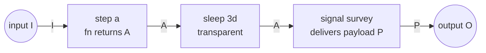

# iterativeflow

Durable, iterative flows on your own Postgres.

Inspired by [Trigger.dev](https://trigger.dev) and [Temporal](https://temporal.io) — same idea (write a flow as code, suspend for hours or days, survive crashes), but it runs **inside your Node app** on [graphile-worker](https://worker.graphile.org) + [drizzle-orm](https://orm.drizzle.team). No separate service to host.

Schemas use [Standard Schema](https://standardschema.dev) — any compliant validator works (zod, valibot, arktype, …).

<!-- doc-check: skip — teaser showing the full flow without setup; full setup below in "Hello flow" -->

```ts
const onboard = flow("onboard")
  .input(z.object({ userId: z.string() }))
  .step("create-account", async ({ input, signal }) => createAccount(input.userId, { signal }))
  .sleep("3d")
  .signal("survey", { schema: z.object({ score: z.number() }) })
  .output(({ input }) => ({ score: input.score }))
  .build();

const handle = engine.register(onboard);
const { runId } = await handle.start({ userId: "u_1" });

// 3 days later, from a webhook:
const result = await engine.signal(runId, "survey", { score: 9 });
switch (result.kind) {
  case "delivered": // the run was awaiting; now resumes
  case "buffered": // signal arrived first; consumed on arm
  case "duplicate": // already accepted; idempotent
  case "expired": // signal's timeout fired; reject the webhook
}

const out = await handle.result(runId); // resolves when terminal
```

That run lives in Postgres for three days. Workers can crash, deploys can roll, the process can be killed and restarted — when the timer fires, the flow resumes from where it left off.

- **Steps** with retries, backoff, per-step timeouts, and **`AbortSignal`** in the step args
- **Sleeps** and external **signals** lasting days or weeks (`ctx.signal(name)`)
- **`ctx.invoke(child, input)`** for child flows / fan-out
- **`handle.result(runId)`** blocks until terminal (via Postgres LISTEN/NOTIFY)
- **`engine.listRuns({ tag, status, since })`** for ops dashboards
- **Versioned flows** — edit a flow's shape and you get a loud error, not silent breakage. Loop bodies are checked for rename/kind drift too.
- **At-least-once** via a transactional outbox; a reconciler picks up anything stranded

## Install

```bash
npm install iterativeflow drizzle-orm graphile-worker pg
```

Peers: `drizzle-orm`, `graphile-worker`, `pg`.

## Setup

### 1. Generate the schema file in your project

```bash
npx iterativeflow generate-schema
# wrote ./iterativeflow-schema.ts
```

This emits a drizzle schema file at the project root (override with `--out`). The file is typed against **your** `drizzle-orm` — so `db.select().from(flowTables.runs)` and drizzle-kit migration generation work regardless of which drizzle version iterativeflow itself was built against. Re-run the command after upgrading iterativeflow.

### 2. Add it to your `drizzle.config.ts`

<!-- doc-check: skip — drizzle-kit's `defineConfig` is implicit in its CLI context -->

```ts
// drizzle.config.ts
import { defineConfig } from "drizzle-kit";

export default defineConfig({
  dialect: "postgresql",
  schema: ["./db/your-schema.ts", "./iterativeflow-schema.ts"],
  out: "./drizzle",
  dbCredentials: { url: process.env.DATABASE_URL! },
});
```

### 3. Customize (optional)

You own the generated file. Rename tables, switch `pgSchema` names, add columns, add indexes. When you customize, pass your `flowTables` to `createEngine({ tables: flowTables })` so the engine knows about the renames — otherwise the engine queries the default `workflow.*` schema and your customizations break it. The default `createEngine({ db, pool })` works with the unmodified generated file.

### 4. Install both schemas

```bash
# install graphile-worker's schema
node -e "import('graphile-worker').then(m => m.migrate({ pgPool: pool }))"

# install iterativeflow's workflow.* schema
npx drizzle-kit generate && npx drizzle-kit migrate
```

Or apply iterativeflow's bundled SQL directly: `psql -f node_modules/iterativeflow/migrations/0000_init.sql`.

## Hello flow

<!-- doc-check: skip — uses external `createAccount`; runnable shape only -->

```ts
import { Pool } from "pg";
import { drizzle } from "drizzle-orm/node-postgres";
import { createEngine, flow } from "iterativeflow";
import { z } from "zod";

const pool = new Pool({ connectionString: process.env.DATABASE_URL });
const db = drizzle(pool);
const engine = createEngine({ db, pool });

const onboard = flow("onboard")
  .version(1)
  .input(z.object({ userId: z.string() }))
  .step("account", ({ input }) => createAccount(input.userId))
  .sleep("3d")
  .signal("survey", { schema: z.object({ score: z.number() }) })
  .output(({ input }) => ({ score: input.score }))
  .build();

const handle = engine.register(onboard);
await engine.listen();

const { runId } = await handle.start({ userId: "u_1" });
await engine.signal(runId, "survey", { score: 9 }); // from a webhook later
const out = await handle.result(runId); // resolves when terminal
```

## Defaults you should know

A few load-bearing semantics that surprise people. Read once.

1. **Steps are memoized forever.** Once a step result is stored, the body never re-runs for that `runId`. A code change to a step body between deploys → resumed runs use the OLD result. Bump the flow `.version(N)` to get the new code.
2. **The top of the flow body re-runs on every resume.** Memoized steps short-circuit; signals/sleeps short-circuit. Don't put side effects at the top level — wrap them in `ctx.step`.
3. **`Date.now()` / `Math.random()` at the top level is non-deterministic.** Wrap in `ctx.step("now", () => Date.now())` to memoize.
4. **`AbortSignal` must be honored.** A step that ignores `signal` keeps running after a timeout/cancel — the engine throws on time but the work continues. Pass `signal` to `fetch`, `pg`, `undici`, OpenAI SDKs.
5. **Error codes are stable across patches; error messages are not.** Alert on `code`, log the message.
6. **`engine.signal(runId, name, payload)` is single-consumer.** Not pub/sub. Each call delivers to one armed `ctx.signal` (or buffers for the first arm).
7. **Idempotency keys are scoped to `(name, version, key)`.** Cross-version dedup is intentionally NOT happening. Bumping `.version(N)` lets the same key start a fresh run.
8. **No defaults you might assume exist:**
   - `StepOpts.retries` default `0` — a step runs once; opt in with `retries: N` (steps re-run on crash or retry, so keep side effects idempotent)
   - `worker.concurrency` default `5` — bump for high throughput
   - `limits.defaultStepTimeoutMs` default `undefined` — a step can hang forever unless you set it
   - `limits.*Bytes` default `undefined` — no payload size cap unless you set it
   - `retention` default off — `events` and `runs` tables grow forever unless configured
   - cron `timezone` default `UTC` — set `timezone: "America/Los_Angeles"` etc. if you need local time
9. **The pool is yours.** `engine.stop()` does NOT call `pool.end()`. Call it yourself in your shutdown sequence.
10. **`limits.maxRunAttempts` default `100`.** Poison-pill runs die after that with `RUN_ATTEMPTS_EXHAUSTED`.
11. **`ctx.invoke` has tree caps.** `limits.maxInvokeDepth` default `10` (root counts as 1); `limits.maxChildrenPerRun` default `1000`. Exceeding either throws `INVOKE_DEPTH_EXCEEDED` / `INVOKE_FANOUT_EXCEEDED` non-retryably. Stops accidental infinite recursion or runaway fan-out from filling the runs table.

Full reference: [docs/replay-semantics.md](docs/replay-semantics.md), [docs/signals.md](docs/signals.md).

## The model



A flow is a linear chain (with optional loops). Each `.step()` fn is memoized by `(runId, cursor_key)` and **re-runs only if no result is stored**. `sleep` and `signal` suspend the run durably; the engine resumes it later from snapshot.

Inside a step / flow body:

<!-- doc-check: skip — bare body shape; no ctx/url/childHandle binding -->

```ts
async (ctx) => {
  const x = await ctx.step("fetch", async ({ signal }) => fetch(url, { signal }));
  await ctx.sleep("1h");
  const survey = await ctx.signal<{ score: number }>("survey", {
    timeout: "7d",
  });
  const summary = await ctx.invoke(childHandle, { x, survey }); // child flow
  return summary;
};
```

## Production

<!-- doc-check: skip — references in-scope `db`/`pool`/`counters`/`histograms` -->

```ts
const engine = createEngine({
  db,
  pool, // caller-owned; ≥ worker.concurrency + headroom
  logger: consoleLogger(), // or your own Logger
  worker: { concurrency: 10 },
  retention: {
    eventsOlderThan: "30d",
    runsOlderThan: "90d",
    schedule: "0 * * * *", // hourly
  },
  limits: {
    maxRunAttempts: 100, // hard ceiling — stops poison-pill loops
    defaultStepTimeoutMs: 30 * 60_000, // 30m fallback per step
    maxInputBytes: 256 * 1024,
    maxStepResultBytes: 256 * 1024,
    maxSignalPayloadBytes: 64 * 1024,
  },
  metrics: {
    runStarted: ({ name }) => counters.runs_started.inc({ name }),
    runCompleted: ({ name, durationMs }) => histograms.run_duration.observe({ name }, durationMs),
    stepFinished: ({ status, durationMs }) => histograms.step.observe({ status }, durationMs),
    signalDelivered: ({ kind }) => counters.signals.inc({ kind }),
  },
});

const detach = engine.attachShutdownSignals();
await engine.listen();
```

**`AbortSignal` in steps.** Every step fn receives `{ input, signal, attempt }`. Pass `signal` to `fetch`, `undici`, `pg`, `openai` SDKs — `engine.cancel(runId)` propagates an abort. With `limits.defaultStepTimeoutMs` set, a hung step gets a `step "name" exceeded timeoutMs=...` error AND the abort fires.

**Multi-tenant idempotency.** The unique constraint is `(name, version, idempotencyKey)`. For multi-tenant deployments prefix the key yourself: `idempotencyKey: \`\${tenantId}:\${requestId}\``.

**Pool ownership.** `createEngine` doesn't own the `pg.Pool`. Call `engine.stop()` then `pool.end()` in your shutdown path.

**Versioning.** `.version(N)` enforces positive integers and forbids regression. Changes to a flow's shape between versions are caught by the replay-compat check — including **renames inside loop bodies** (occurrence count inside a loop is dynamic, but base names are still verified).

**Non-retryable errors.** Throw `FlowRuntimeError` with `nonRetryable: true` to skip retries on a permanent failure:

<!-- doc-check: skip — bare body snippet; no ctx binding -->

```ts
import { FlowRuntimeError } from "iterativeflow";

await ctx.step("charge", async () => {
  if (declined) {
    throw new FlowRuntimeError({
      code: "CARD_DECLINED",
      message: "issuer declined",
      nonRetryable: true,
    });
  }
});
```

Full concepts, versioning, failure modes, and reference: **[docs/guide.md](docs/guide.md)**.

## License

MIT
