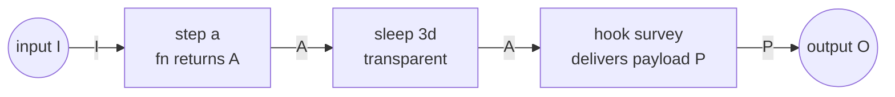

# iterative

Durable, iterative workflows on your own Postgres.

Inspired by [Trigger.dev's workflow SDK](https://trigger.dev) and
[Temporal](https://temporal.io) — same idea (write a workflow as code,
suspend for hours or days, survive crashes), but it runs **inside your
Node app** on top of [graphile-worker](https://worker.graphile.org) and
[drizzle-orm](https://orm.drizzle.team). No separate service to host.

Schemas use [Standard Schema](https://standardschema.dev), so any compliant
validator works — zod, valibot, arktype, etc. Pick yours.

```ts
const onboard = flow("onboard")
  .input(z.object({ userId: z.string() }))
  .step("create-account", ({ input }) => createAccount(input.userId))
  .sleep("3d")
  .hook("survey", { schema: z.object({ score: z.number() }) })
  .output(({ input }) => ({ score: input.score }))
  .build();

const handle = engine.register(onboard);
const { runId } = await handle.start({ userId: "u_1" });

// 3 days later, from a webhook:
await engine.signal(runId, "survey", { score: 9 });
```

That run lives in Postgres for three days. Workers can crash, deploys can
roll, the process can be killed and restarted — when the timer fires, the
workflow resumes from where it left off.

- Steps with retries, backoff, and per-step timeouts
- Sleeps and external hooks that last days or weeks
- Loops in the builder + raw `defineWorkflow` for whatever shape you need
- Versioned flows — edit a flow's shape and you get a loud error, not silent breakage
- At-least-once via a transactional outbox; a reconciler picks up anything stranded

## Install

```bash
npm install iterativeflow drizzle-orm graphile-worker pg
```

Peers: `drizzle-orm`, `graphile-worker`, `pg`.

## Setup

Install both schemas once at deploy:

```ts
import { migrate } from "graphile-worker";
await migrate({ pgPool: pool }); // graphile_worker schema
```

For the engine's own `workflow.*` schema, point drizzle-kit at the exported
table definitions:

```ts
// drizzle.config.ts
import { defineConfig } from "drizzle-kit";
export default defineConfig({
  dialect: "postgresql",
  schema: ["./node_modules/iterativeflow/dist/storage/schema.js"],
  out: "./drizzle",
  dbCredentials: { url: process.env.DATABASE_URL! },
});
```

```bash
npx drizzle-kit generate && npx drizzle-kit migrate
```

## Hello flow

```ts
import { Pool } from "pg";
import { drizzle } from "drizzle-orm/node-postgres";
import { createEngine, flow } from "iterativeflow";
import { z } from "zod";

const pool = new Pool({ connectionString: process.env.DATABASE_URL });
const db = drizzle(pool);
const engine = createEngine({ db, pool, logger: console as any });

const onboard = flow("onboard")
  .version(1)
  .input(z.object({ userId: z.string() }))
  .step("account", ({ input }) => createAccount(input.userId))
  .sleep("3d")
  .hook("survey", { schema: z.object({ score: z.number() }) })
  .output(({ input }) => ({ score: input.score }))
  .build();

const handle = engine.register(onboard);
await engine.start();

const { runId } = await handle.start({ userId: "u_1" });
await engine.signal(runId, "survey", { score: 9 }); // from a webhook later
const out = await handle.output(runId); // once done
```

## The model



A flow is a linear chain. Each `.step()` fn is memoized by `(runId, name)` and
**re-runs only if no result is stored**. `sleep` and `hook` suspend the run
durably; the engine resumes it later from snapshot. Code never executes
between nodes — the builder makes that structurally impossible.

> The diagrams below + in [`docs/guide.md`](docs/guide.md) use Mermaid.
> GitHub renders them inline; in VS Code install the
> _Markdown Preview Mermaid Support_ extension.

## API

- `createEngine({ db, pool, logger, ... })` → `Engine`
- `flow(name).version().input().step()/.sleep()/.hook()/.loop().output().build()` → `FlowDefinition`
- `engine.register(def)` → `WorkflowHandle<I, O>` ( `{ name, version, start, output }` )
- `engine.defineWorkflow({ name, version, input, run })` → same handle, low-level escape hatch for loops / dynamic graphs
- `engine.signal(runId, name, payload?)` / `engine.cancel(runId, reason?)`
- `engine.status(runId)` / `engine.pruneEvents(...)` / `engine.pruneRuns(...)`
- `engine.defineCron(spec)`

Full concepts, versioning, failure modes, and reference: **[docs/guide.md](docs/guide.md)**.
Worked use cases (checkout, onboarding, multi-agent AI + human-in-loop,
multi-signer, saga, account deletion): **[docs/examples/](docs/examples/)**.

## License

MIT
