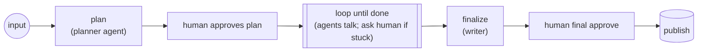

# Multi-agent dialogue with dynamic human-in-loop

The conductor is the flow. Agents talk to each other inside a step. The loop
runs until the dialogue settles or the human ends it. Each iteration **only
pauses for the human if an agent actually asks** — otherwise it glides
through via a pre-signal trick.



## The agent dialogue (a helper, not a node)

```ts
async function orchestrate(topic: string, externalHistory: Turn[]) {
  const dialogue: Turn[] = [];
  for (let i = 0; i < 4; i++) {
    const r = await researcherAgent.respond({ topic, history: [...externalHistory, ...dialogue] });
    dialogue.push({ from: "researcher", msg: r.text });
    if (r.needsHuman) return { done: false, needsHuman: true, question: r.question, dialogue };

    const c = await criticAgent.respond({ topic, history: [...externalHistory, ...dialogue] });
    dialogue.push({ from: "critic", msg: c.text });
    if (c.satisfied) return { done: true, needsHuman: false, dialogue };
    if (c.needsHuman) return { done: false, needsHuman: true, question: c.question, dialogue };
  }
  return { done: false, needsHuman: false, dialogue };
}
```

## The conductor (the flow)

```ts
type State = {
  topic: string;
  requesterId: string;
  history: Turn[];
  done: boolean;
};

const consultSchema = z.object({
  skip: z.boolean().optional(),
  answer: z.string().optional(),
});

const collab = flow("collaborative-research")
  .version(1)
  .input(z.object({ topic: z.string(), requesterId: z.string() }))

  .step("plan", ({ input }) =>
    planner
      .run({ idempotencyKey: `plan:${hash(input.topic)}`, topic: input.topic })
      .then((plan) => ({ ...input, plan, history: [] as Turn[], done: false })),
  )

  .step("notify-plan", ({ input }) =>
    notifications.send({
      idempotencyKey: `notify-plan:${input.topic}`,
      userId: input.requesterId,
      template: "review_plan",
      data: { plan: input.plan },
    }),
  )

  .hook(
    "plan-approved",
    { schema: z.object({ approved: z.boolean() }), timeout: "3d" },
    (input, payload) => ({ ...input, planApproved: payload.approved }),
  )

  // The loop runs as many passes as the agents need.
  // Each pass: agents talk → either ask human or pre-signal skip → consume.
  .loop({ until: (s: State) => s.done }, (sub) =>
    sub
      .step(
        "agent-pass",
        async ({ ctx, input }) => {
          if (!input.planApproved) throw new Error("PLAN_REJECTED");

          const result = await orchestrate(input.topic, input.history);
          const history = [...input.history, ...result.dialogue];

          if (result.needsHuman) {
            await notifications.send({
              idempotencyKey: `consult:${ctx.runId}:${history.length}`,
              userId: input.requesterId,
              template: "agent_question",
              data: { question: result.question },
            });
          } else {
            // No human needed — pre-signal the upcoming hook so it
            // resolves instantly when the workflow reaches it.
            await engine.signal(ctx.runId, "consult", { skip: true });
          }

          return { ...input, history, done: result.done };
        },
        { retries: 1, timeoutMs: 15 * 60_000 },
      )
      .hook("consult", { schema: consultSchema, timeout: "2d" }, (input, payload) =>
        payload.skip || !payload.answer
          ? input
          : {
              ...input,
              history: [...input.history, { from: "human", msg: payload.answer }],
            },
      ),
  )

  .step("finalize", ({ input }) =>
    writer
      .compose({
        idempotencyKey: `final:${hash(JSON.stringify(input.history))}`,
        topic: input.topic,
        history: input.history,
      })
      .then((final) => ({ ...input, final })),
  )

  .step("notify-final", ({ input }) =>
    notifications.send({
      idempotencyKey: `notify-final:${input.topic}`,
      userId: input.requesterId,
      template: "approve_final",
      data: { final: input.final },
    }),
  )

  .hook(
    "final-approved",
    { schema: z.object({ approved: z.boolean() }), timeout: "5d" },
    (input, payload) => ({ ...input, finalReview: payload }),
  )

  .step(
    "publish",
    ({ input }) => {
      if (!input.finalReview.approved) throw new Error("FINAL_REJECTED");
      return cms.publish({
        idempotencyKey: `publish:${input.topic}`,
        title: input.topic,
        body: input.final,
      });
    },
    { retries: 0, classify: () => "permanent" },
  )

  .output(({ input }) => ({ topic: input.topic, turns: input.history.length }))
  .build();

engine.register(collab);
```

Notes:

- Agents talk inside `orchestrate()` — the whole researcher↔critic loop is one memoized step.
- When an agent doesn't need the human, `engine.signal(ctx.runId, "consult", { skip: true })` pre-buffers the hook so it resolves instantly when `.loop` reaches it.
- `.loop` opts out of the compat guard (iteration count is dynamic). Versioning still pins runs to their `name@version`.

## Infinite chat

A session that lives forever until the user signals `end`:

```ts
const chat = flow("chat-session")
  .input(z.object({ userId: z.string() }))
  .step("init", ({ input }) => ({ ...input, history: [] as Turn[], done: false }))
  .loop({ until: (s) => s.done }, (sub) =>
    sub
      .hook(
        "user-msg",
        { schema: z.object({ text: z.string(), end: z.boolean().optional() }) },
        (state, msg) =>
          msg.end
            ? { ...state, done: true }
            : { ...state, history: [...state.history, { from: "user", msg: msg.text }] },
      )
      .step("respond", async ({ input }) => {
        if (input.done) return input; // last iteration: end signal arrived, just exit
        const reply = await agent.respond(input.history);
        return {
          ...input,
          history: [...input.history, { from: "agent", msg: reply }],
        };
      })
      .step("push-to-user", async ({ ctx, input }) => {
        if (input.done) return input;
        await push.send({
          idempotencyKey: `push:${ctx.runId}:${input.history.length}`,
          userId: input.userId,
          msg: input.history[input.history.length - 1].msg,
        });
        return input;
      }),
  )
  .output(({ input }) => input)
  .build();
```

Each user turn is one `engine.signal(runId, "user-msg", { text: "..." })`; signal `{ text: "", end: true }` to close out.

The cost of "infinite": snapshot + replay grow linearly with turns (every turn adds ~3 rows + events). Fine for human-paced chat (hours/weeks); wrong shape for inner-loop reasoning (sub-second token loops belong inside one big step, not the engine).
