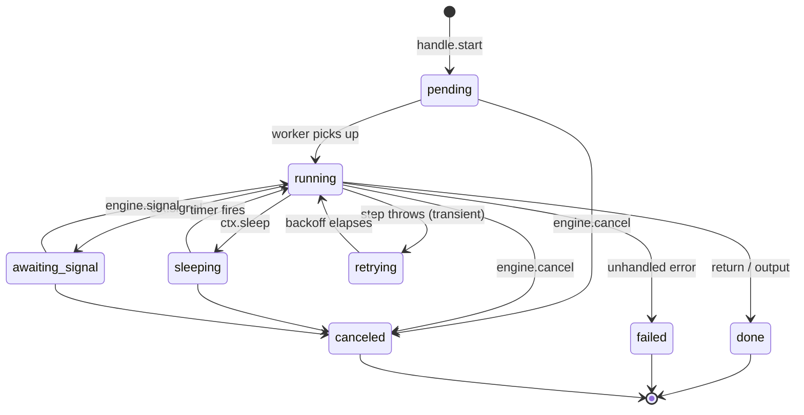
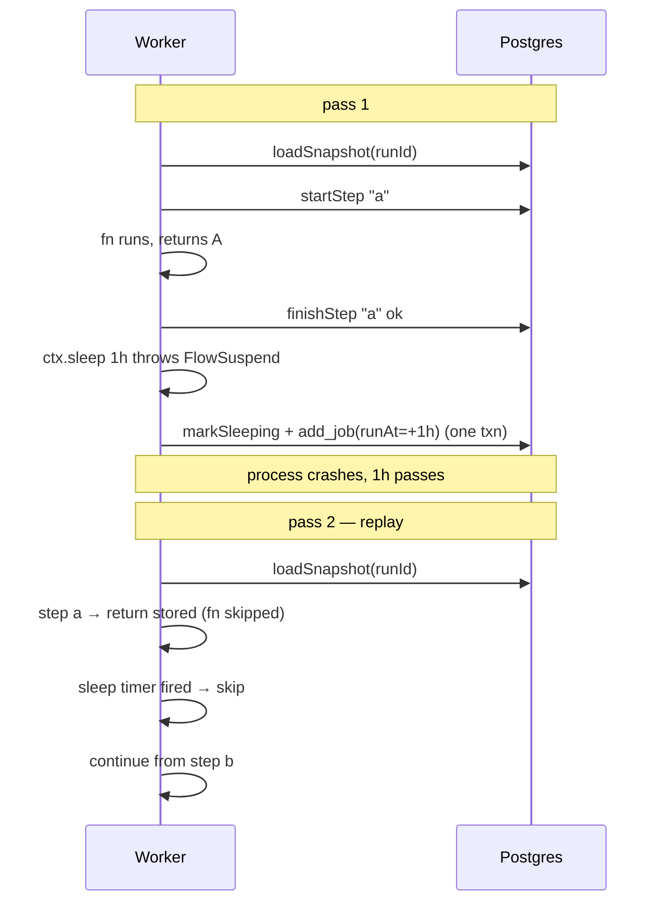
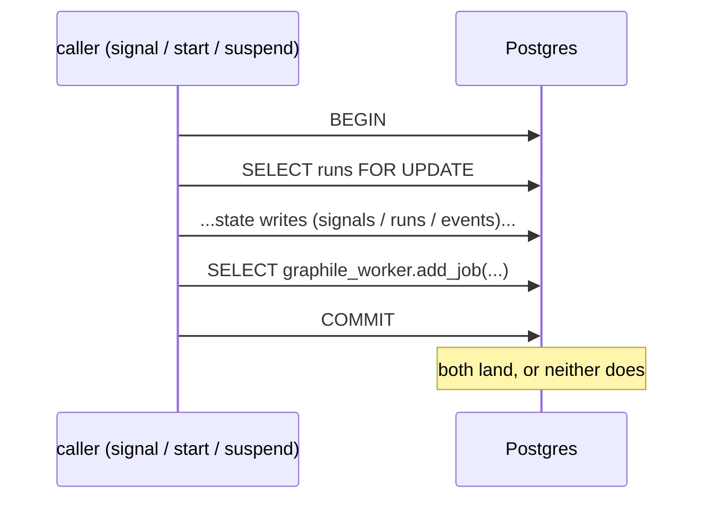
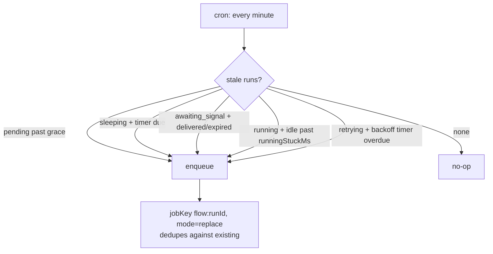
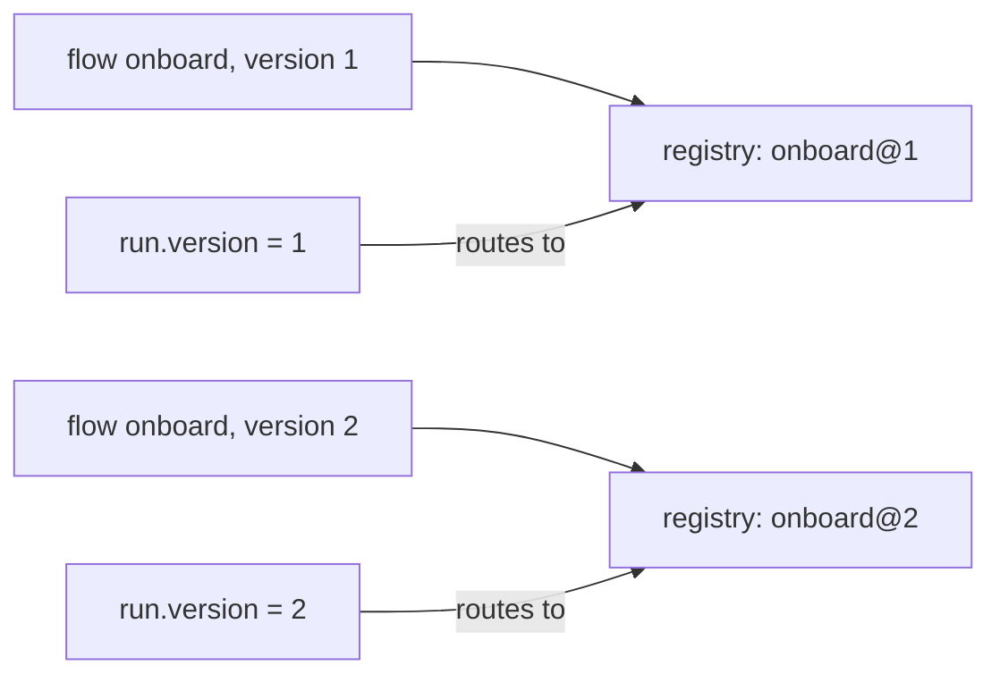

# Guide

Everything beyond the README — how it works, the rules you must follow, what
fails and how, and the full reference.

## How it works

### Run lifecycle



`done` / `failed` / `canceled` are terminal — the engine won't auto-retry from
them. The reconciler only re-drives non-terminal runs.

### Replay

The flow body re-executes from the top on every resume. Only `.step`
results are persisted; on replay the engine returns the stored result without
running the fn again.



This is durable execution. **Side effects and non-determinism must live inside
a `.step()` fn**, or they will repeat / diverge on replay. The node builder
makes that structural — there's no "between nodes" space.

### The single value channel

```
input ──► step('a') ──► step('b') ──► sleep ──► signal ──► step('c') ──► output
   I        I → A         A → B       B (pass)   B → P       P → C        C → O
```

Each step fn receives `{ input, signal, attempt }` and returns the next channel
value. `sleep` is transparent (channel unchanged). `signal` replaces the
channel with the delivered payload, or with `merge(input, payload)` if you
provide a merge fn — that's how to carry an earlier value past a signal.

### Loops

`.loop({ until }, sub => ...)` repeats the body until the predicate on the
current channel returns true. The body's start/end channel type must match
(every iteration's first node sees what the last node returned).

<!-- doc-check: skip — partial builder chain; shown for shape illustration -->

```ts
.loop(
  { until: (state) => state.done },
  (sub) => sub
    .signal("user-msg", { schema: msgSchema }, (state, msg) =>
      msg.end
        ? { ...state, done: true }
        : { ...state, history: [...state.history, msg] },
    )
    .step("respond", ({ input }) =>
      input.done ? input : agent.respond(input.history).then((r) => ({
        ...input,
        history: [...input.history, { from: "agent", msg: r }],
      })),
    ),
)
```

Same-name nodes inside the body get the cursor's `:N` suffix per iteration —
`signal:user-msg`, `signal:user-msg:1`, `signal:user-msg:2`, … and
`engine.signal` targets whichever is currently armed.

Trade-offs: **the compat guard is partial** for graphs containing a `.loop`
(iteration count is dynamic; rename/kind drift inside the body IS still
detected), and snapshot + replay cost grow linearly with iteration count. Good
for sessions of dozens to thousands of turns; wrong shape for inner-loop
reasoning.

### Advanced: `defineFlow` (low-level)

For flows the builder can't express (dynamic step names, computed graphs,
exotic control flow), drop to the raw context:

<!-- doc-check: skip — illustrative; assumes an `agent.respond` external -->

```ts
import { defineFlow } from "iterativeflow";

declare const agent: { respond(history: unknown[]): Promise<string> };

const flow = defineFlow({
  name: "chat",
  version: 1,
  body: async (ctx, _input: unknown) => {
    const history: { from: string; text: string }[] = [];
    let i = 0;
    while (true) {
      const msg = await ctx.signal<{ text: string; end?: boolean }>("user-msg");
      if (msg.end) return history;
      history.push({ from: "user", text: msg.text });
      const reply = await ctx.step(`reply-${i}`, () => agent.respond(history));
      history.push({ from: "agent", text: reply });
      i++;
    }
  },
});
```

You get `ctx.step` / `ctx.sleep` / `ctx.signal` / `ctx.invoke` / `ctx.log` and
full JS control flow. The compat guard doesn't apply (no node graph to
compare). All other guarantees (replay, durability, lock-order, reconciler)
still hold. Prefer the builder when the shape fits; reach for this when it
doesn't.

## Durability

### Transactional outbox

State writes and queue inserts commit in the **same Postgres transaction**, so
a crash can never leave "DB says resume me" without a job to do it.



### Lock-order rule (no deadlock by construction)

Every transaction acquires locks in one order:

```
runs FOR UPDATE  →  signals / timers / steps  →  graphile_worker.jobs
```

Two concurrent parties serialize on the `runs` row; they can't cycle. **User
step fns never run inside a transaction** — `ctx.step` is `startStep (own
txn) → fn (no txn) → finishStep (own txn)`. A slow step can't hold a lock.

### Reconciler

A cron runs every minute. On a healthy system it does nothing — one indexed
SELECT, zero rows. It earns its keep when graphile-worker permanently fails a
job (max_attempts), manual ops, replication failover, etc.



Tune with `reconciler: { graceMs, runningStuckMs, schedule }`, or disable via
`reconciler: false`.

### Restart behavior

What's persisted vs in-process:

| State                                   | Survives restart?                                                             |
| --------------------------------------- | ----------------------------------------------------------------------------- |
| `running` runs                          | Yes — reconciler re-enqueues after `runningStuckMs`                           |
| `retrying` runs                         | Yes — backoff deadline is a timer; reconciler re-enqueues if the wake is lost |
| `sleeping` runs                         | Yes — `run_at` is in `graphile_worker.jobs`                                   |
| `awaiting_signal` runs                  | Yes — signal arrives via DB, NOTIFY fans cross-instance                       |
| Idempotency keys                        | Yes — scoped by `(name, version, key)` in DB                                  |
| Cron advisory locks (`overlap: "skip"`) | Yes — released on process exit; next tick re-acquires                         |
| `handle.result(runId)` waiters          | **No** — in-process Promise; caller must retry                                |
| `handle.wait(runId, ...)` waiters       | **No** — same as above                                                        |
| In-flight `AbortController`             | **No** — `engine.cancel` on a crashed run is harmless                         |

**Step semantics on restart are at-least-once.** A crash between step body
completion and the `finishStep` commit re-runs the body on resume. Make
step bodies idempotent if their side effects matter — `Idempotency-Key`
header on external calls, `INSERT ... ON CONFLICT DO NOTHING` for inserts.

**Crash recovery latency = `reconciler.runningStuckMs`** (default 10 min). Lower
it if your operations need faster recovery (`createEngine({ reconciler: {
runningStuckMs: 60_000 } })`); the cost is a more aggressive reconciler that may
re-enqueue a still-running but slow step. The engine warns at boot if
`reconciler.runningStuckMs < limits.defaultStepTimeoutMs` — without that bound, the
reconciler can resurrect a step that's still legitimately running,
producing two concurrent attempts on the same run.

**Multi-instance / rolling deploys.** Two engines on the same DB are
safe: `claimRun` uses `FOR UPDATE` + `SKIP LOCKED` at the graphile layer,
and `pg_notify('flow_terminal', ...)` reaches every subscribed engine.
The new engine picks up the queue as soon as it calls `listen()`; the
old engine drains on `stop()`.

## Versioning

A flow's `.version(N)` makes it identity-bearing. Runs record the version
they started on; the engine routes every resume back to that version.



Register both versions side-by-side; old runs drain on v1, new runs use v2.

**Decision rule**:

- Logic-only fix INSIDE a step's fn → **keep version**.
- Shape change (added / removed / renamed step, reordered, loop count) → **bump version, register both**.

If you forget and edit the graph in place, resumed runs of older history fail
loudly:

- `REPLAY_INCOMPATIBLE_VERSION` — a recorded step is no longer in the graph.
- `REPLAY_NON_DETERMINISTIC` — a same-name step's occurrence count shifted.

Never silent corruption.

## Authoring rules

What the engine **cannot enforce** and you must own.

### Determinism

| Don't                                        | Do                                            |
| -------------------------------------------- | --------------------------------------------- |
| `crypto.randomUUID()` / `Date.now()` in glue | Compute inside a `.step()` fn                 |
| Call an API / write a row outside a step     | It IS a `.step()` — no other place            |
| Non-pure `merge` / `output` fn               | Pure transforms only — they re-run on replay  |
| `ctx.sleep` / `ctx.signal` inside a step fn  | Move to top-level (else `STEP_INVALID_AWAIT`) |

### Per-step hygiene

- **Set `timeoutMs` on every step doing I/O.** A hung fn pins a worker slot
  indefinitely; with the timeout it becomes a transient error (retried only if
  you set `retries`).
- **Steps don't retry by default (`retries: 0`).** Opt in per step with
  `retries: N`. Steps re-run on crash recovery regardless, so keep
  side-effecting bodies idempotent.
- **Keep step results small.** Every completed result is loaded into RAM on
  every replay. Use pointers (IDs, S3 keys) not blobs.
- **Make step fns idempotent.** At-least-once delivery — a crash between the
  side effect and `finishStep` re-runs the fn. Use idempotency tokens on
  external calls.

### Engine lifecycle

- Install `graphile_worker` schema before `engine.listen()` (`await migrate({ pgPool })`).
- Register all flows (`engine.register`) and `defineCron` specs before `engine.listen()` — the
  worker's task list is fixed at `listen()`; late calls throw. A process claims only the flows it
  registered, so split workers by registering a subset (a clone-only worker registers just the
  clone flow), and an enqueue-only API registers flows for `.start` handles but never `listen()`s.
- Pool size ≥ `concurrency + handles awaiting result() + reconciler headroom`.
- Configure retention (or run your own retention cron) — see [retention](#retention).

### Enqueue-only processes (flow contracts)

An API process that only _starts_ flows should not import the flow body and its
heavy deps. Split the flow into a light **contract** and a heavy
**implementation** built from it:

<!-- doc-check: skip — illustrative; the typed pattern is covered by contract.test.ts -->

```ts
// clone.contract.ts — light; imported by the API
export const cloneContract = defineContract<{ mediaId: string }, { status: "done" }>({
  name: "clone-media",
  version: 1,
  input: z.object({ mediaId: z.string() }),
});

// clone.flow.ts — heavy (native deps); lives with the worker
export const cloneFlow = flow(cloneContract)
  .step("copy", ({ input }) => copyWithNodeAv(input.mediaId))
  .output(() => ({ status: "done" as const }))
  .build();

// API: typed .start, no body import, no listen()
await engine.enqueueHandle(cloneContract).start({ mediaId });
// Worker: registers the body and claims the run
engine.register(cloneFlow);
await engine.listen();
```

Both agree on `clone-media@1` and its input/output because they share the
contract object — a mismatched `.start` or a body returning the wrong output is a
compile error. `engine.enqueue(name, version, input)` is the untyped escape hatch
for dynamic callers.

## What you don't get

- **Exactly-once.** At-least-once is the contract.
- **Automatic whole-run retry.** Failed = terminal.
- **Branching combinators in the builder.** Linear chains; branch via a step's return or via `defineFlow`.
- **Per-flow concurrency limits.** One global `concurrency` on graphile-worker.
- **Graceful drain on `engine.stop()`.** It drains in-flight tasks via graphile-worker's stop semantics.

## Failure-mode reference

| Symptom                             | Cause                                                        | Fix                                               |
| ----------------------------------- | ------------------------------------------------------------ | ------------------------------------------------- |
| Run stays `pending` after `start()` | `graphile_worker` schema missing OR no worker process        | Run `migrate({ pgPool })`; call `engine.listen()` |
| Run stays `sleeping` past wake      | Worker fleet was down; reconciler will recover within ~1 min | None — auto-heals                                 |
| `FLOW_UNKNOWN` on resume            | Replica missing the `name@version`                           | Register on every replica                         |
| `REPLAY_INCOMPATIBLE_VERSION`       | Graph edited without bumping version                         | Restore step OR publish v2 alongside              |
| `REPLAY_NON_DETERMINISTIC`          | Same-name step occurrence count changed                      | Same as above                                     |
| `SIGNAL_TIMEOUT`                    | Signal `timeout` elapsed                                     | Operator decision; engine did its job             |
| `STEP_INVALID_AWAIT`                | `ctx.sleep` / `ctx.signal` / `ctx.invoke` inside a step fn   | Move them to top-level                            |
| `SIGNAL_PAYLOAD_INVALID`            | Stored payload fails current schema                          | Widen schema or accept                            |
| `SCHEMA_MISMATCH`                   | DB schema differs from engine's expected version             | `drizzle-kit generate && drizzle-kit migrate`     |
| `INVOKE_DEPTH_EXCEEDED`             | `ctx.invoke` chain exceeded `maxInvokeDepth`                 | Restructure or raise the cap                      |
| `INVOKE_FANOUT_EXCEEDED`            | Single run spawned > `maxChildrenPerRun` children            | Batch differently or raise the cap                |
| Worker slot stuck forever           | Step fn hung without `timeoutMs`                             | Add `StepOpts.timeoutMs`                          |
| `events` table growing unboundedly  | No retention configured                                      | Set `EngineOpts.retention` or register pruning    |

## Retention

The engine ships a built-in retention cron — opt in via `EngineOpts`:

```ts
import type { Pool } from "pg";
import type { WorkflowDb } from "iterativeflow";
import { createEngine } from "iterativeflow";

declare const db: WorkflowDb;
declare const pool: Pool;

const engine = createEngine({
  db,
  pool,
  retention: {
    runsOlderThan: "30d",
    eventsOlderThan: "14d",
    schedule: "0 4 * * *",
  },
});
```

Or run your own:

<!-- doc-check: skip — assumes consumer-generated `./iterativeflow-schema` import -->

```ts
import type { Pool } from "pg";
import type { WorkflowDb } from "iterativeflow";
import { createEngine } from "iterativeflow";

declare const db: WorkflowDb;
declare const pool: Pool;

const engine = createEngine({ db, pool });
engine.defineCron({
  name: "prune",
  schedule: "0 4 * * *",
  run: async () => {
    const olderThan = new Date(Date.now() - 30 * 24 * 60 * 60 * 1000);
    await engine.pruneRuns({ olderThan, batchSize: 5000 });
    await engine.pruneEvents({ olderThan, batchSize: 10000 });
  },
});
```

`pruneRuns` only deletes terminal runs (`done` / `failed` / `canceled`) and
cascades to steps / timers / signals / events through FK.

## Reference

### `EngineOpts`

| Field        | Type              | Default  | Note                                                                  |
| ------------ | ----------------- | -------- | --------------------------------------------------------------------- |
| `db`         | `WorkflowDb`      | required | drizzle Postgres handle                                               |
| `pool`       | `pg.Pool`         | required | shared with graphile-worker                                           |
| `logger`     | `Logger`          | noop     | `{ debug, info, warn, error }`                                        |
| `metrics`    | `MetricsRecorder` | —        | optional telemetry recorder                                           |
| `worker`     | `object`          | —        | `{ schema, concurrency, pollInterval, enqueue }`                      |
| `reconciler` | `false \| object` | on       | `false` to disable, or `{ schedule, graceMs, runningStuckMs }`        |
| `retention`  | `false \| object` | off      | opt in with `{ runsOlderThan, eventsOlderThan, schedule, batchSize }` |
| `limits`     | `object`          | —        | run caps + byte caps + invoke depth/fanout                            |

`worker`:

| Field          | Default             | Note                        |
| -------------- | ------------------- | --------------------------- |
| `schema`       | `"graphile_worker"` | graphile schema name        |
| `concurrency`  | `5`                 | graphile-worker concurrency |
| `pollInterval` | `1000`              | ms between polls            |
| `enqueue`      | graphile `add_job`  | inject your own (tests)     |

`reconciler` (omit = on with defaults; `false` = off):

| Field            | Default     | Note                                              |
| ---------------- | ----------- | ------------------------------------------------- |
| `schedule`       | `* * * * *` | sweep cadence (every minute)                      |
| `graceMs`        | `60_000`    | how stale before re-enqueue                       |
| `runningStuckMs` | `600_000`   | running runs older than this are considered stuck |

### `StepOpts`

| Field           | Type                                  | Default       | Note                                             |
| --------------- | ------------------------------------- | ------------- | ------------------------------------------------ |
| `retries`       | `number`                              | `0`           | additional attempts after first failure (opt in) |
| `baseBackoffMs` | `number`                              | —             | exponential backoff base                         |
| `capBackoffMs`  | `number`                              | —             | cap                                              |
| `backoff`       | `BackoffPolicy`                       | `exponential` | full backoff policy override                     |
| `classify`      | `(err) => "transient" \| "permanent"` | `"transient"` | controls retry vs terminal                       |
| `timeoutMs`     | `number`                              | —             | step fn timeout; expires → transient error       |

### `SignalOpts<T>`

| Field     | Type                           | Note                                                                                   |
| --------- | ------------------------------ | -------------------------------------------------------------------------------------- |
| `schema`  | `StandardSchemaV1<unknown, T>` | any [Standard Schema](https://standardschema.dev) validator (zod, valibot, arktype, …) |
| `timeout` | `Duration`                     | `"3d"`, `"500ms"`, or `number` (ms)                                                    |

### `StartOpts`

| Field            | Type                    | Note                                    |
| ---------------- | ----------------------- | --------------------------------------- |
| `idempotencyKey` | `string`                | same key → returns the existing `runId` |
| `priority`       | `number`                | graphile-worker priority                |
| `delay`          | `Duration`              | wait before first execution             |
| `tags`           | `ReadonlyArray<string>` | filter via `engine.listRuns({ tag })`   |

### `Engine`

<!-- doc-check: skip — interface signature listing, not runnable -->

```ts
register<I, O>(def: FlowDefinition<I, O> | DefineFlowOpts<I, O>): FlowHandle<I, O>
defineCron(spec: CronSpec): void
listen(): Promise<void>
stop(): Promise<void>
signal(runId, signalName, payload?): Promise<SignalDeliveryResult>
cancel(runId, reason?): Promise<void>
status(runId): Promise<RunDetail | undefined>
health(): Promise<HealthReport>
listRuns(opt?): Promise<ListRunsPage>
pruneEvents({ olderThan, batchSize? }): Promise<number>
pruneRuns({ olderThan, status?, batchSize? }): Promise<number>
```

### `FlowHandle<I, O>`

<!-- doc-check: skip — interface signature listing, not runnable -->

```ts
readonly name: string
readonly version: number
start(input: I, opts?: StartOpts): Promise<{ runId, status }>
output(runId): Promise<O | undefined>
result(runId, opt?: { timeoutMs? }): Promise<O>
wait(runId, opts: { until: { step: string } | { signal: string }; timeoutMs? }): Promise<void>
```

Everything runId-keyed lives on `Engine`; the handle carries only what's
typed by `I` and `O`.
