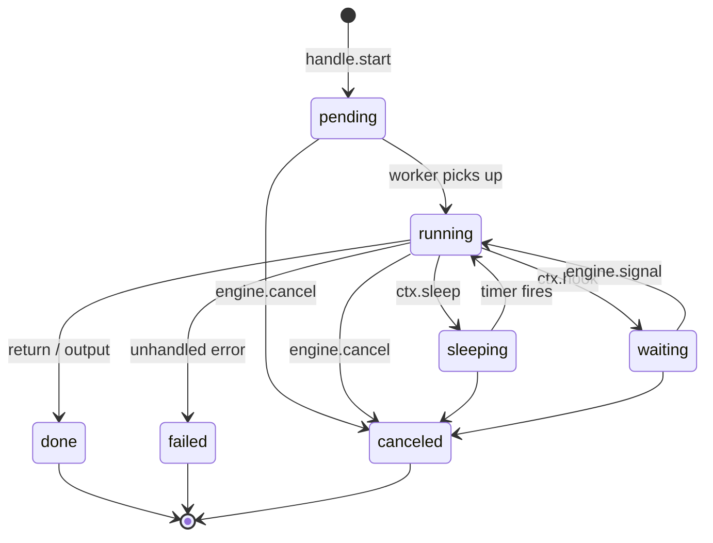
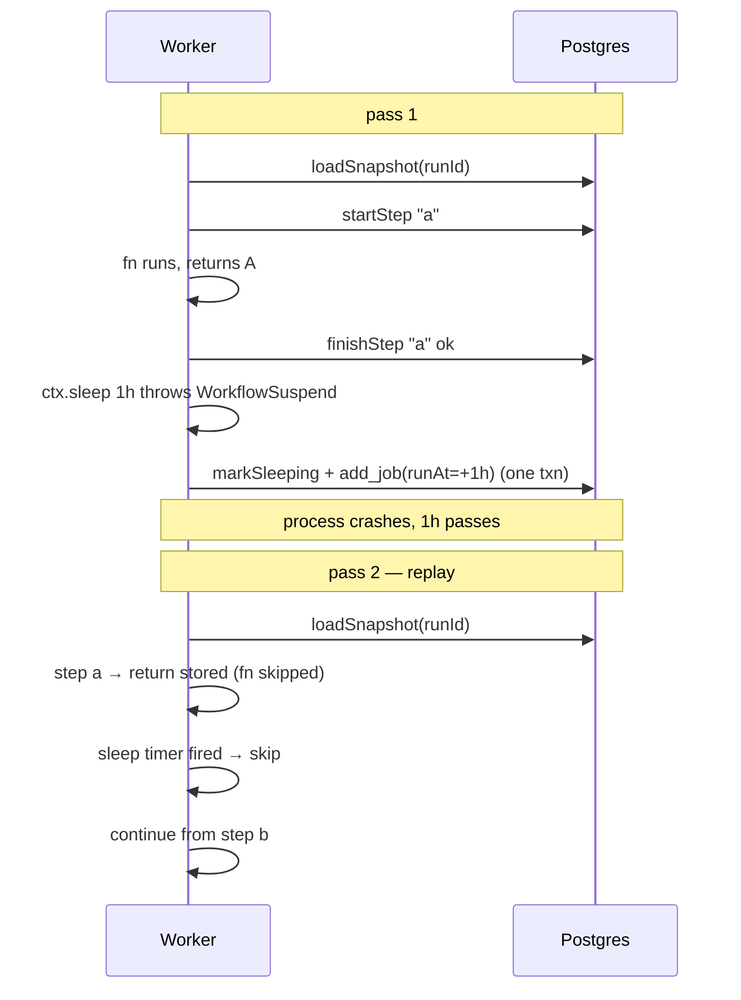
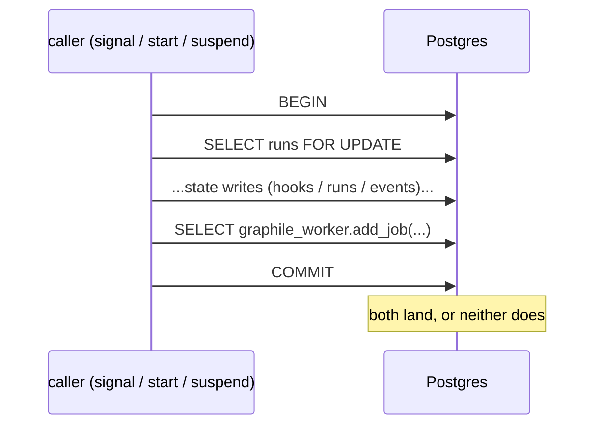
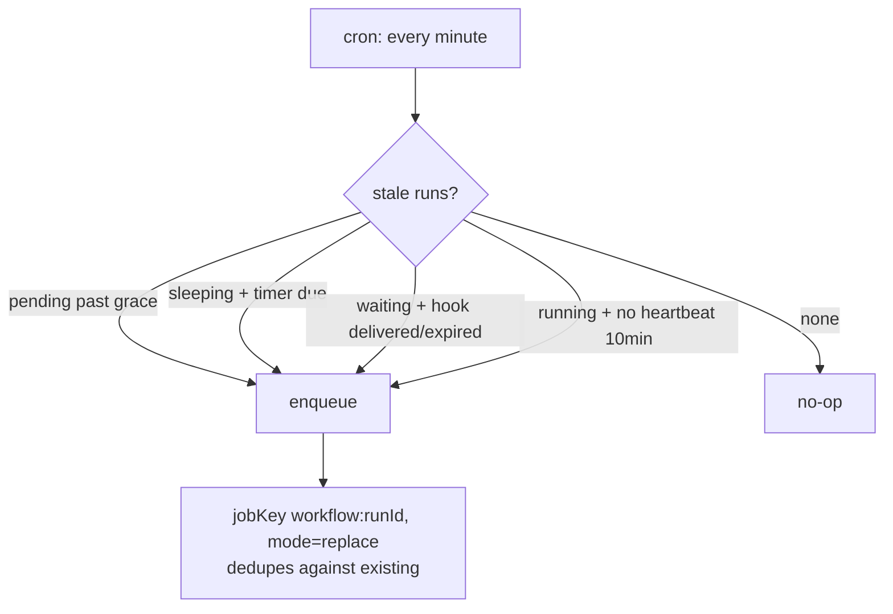
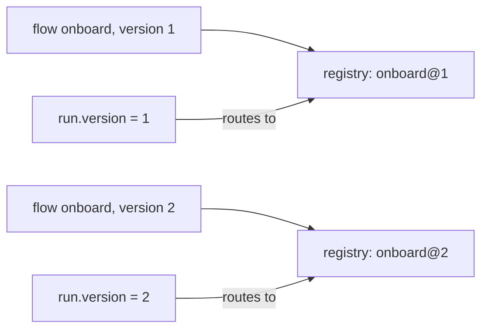

# Guide

Everything beyond the README — how it works, the rules you must follow, what
fails and how, and the full reference. Worked scenarios live in
[`examples/`](examples/).

## How it works

### Run lifecycle



`done` / `failed` / `canceled` are terminal — the engine won't auto-retry from
them. The reconciler only re-drives non-terminal runs.

### Replay

The workflow body re-executes from the top on every resume. Only `.step`
results are persisted; on replay the engine returns the stored result without
running the fn again.



This is durable execution. **Side effects and non-determinism must live inside
a `.step()` fn**, or they will repeat / diverge on replay. The node builder
makes that structural — there's no "between nodes" space.

### The single value channel

```
input ──► step('a') ──► step('b') ──► sleep ──► hook ──► step('c') ──► output
   I        I → A         A → B       B (pass)   B → P     P → C        C → O
```

Each step fn receives `{ ctx, input }` and returns the next `input`. `ctx`
gives `runId`, `attempt`, `log()`. `sleep` is transparent (channel
unchanged). `hook` replaces the channel with the signal payload, or with
`merge(input, payload)` if you provide a merge fn — that's how to carry an
earlier value past a hook.

### Loops

`.loop({ until }, sub => ...)` repeats the body until the predicate on the
current channel returns true. The body's start/end channel type must match
(every iteration's first node sees what the last node returned).

```ts
.loop(
  { until: (state) => state.done },
  (sub) => sub
    .hook("user-msg", { schema: msgSchema }, (state, msg) =>
      msg.end
        ? { ...state, done: true }
        : { ...state, history: [...state.history, msg] },
    )
    .step("respond", ({ input }) =>
      input.done ? input : agent.respond(input.history).then((r) => ({
        ...input,
        history: [...input.history, { from: "agent", msg: r }],
      })),
    ),
)
```

Same-name nodes inside the body get the cursor's `:N` suffix per iteration —
`hook:user-msg`, `hook:user-msg:1`, `hook:user-msg:2`, … and `engine.signal`
targets whichever is currently armed.

Trade-offs: **the compat guard is off** for graphs containing a `.loop`
(iteration count is dynamic), and snapshot + replay cost grow linearly with
iteration count. Good for sessions of dozens to thousands of turns; wrong
shape for inner-loop reasoning.

### Advanced: `defineWorkflow` (low-level)

For workflows the builder can't express (dynamic step names, computed graphs,
exotic control flow), drop to the raw context:

```ts
const handle = engine.defineWorkflow({
  name: "chat",
  version: 1,
  run: async (ctx, input) => {
    const history = [];
    let i = 0;
    while (true) {
      const msg = await ctx.hook<{ text: string; end?: boolean }>("user-msg");
      if (msg.end) return history;
      history.push({ from: "user", text: msg.text });
      const reply = await ctx.step(`reply-${i}`, () => agent.respond(history));
      history.push({ from: "agent", text: reply });
      i++;
    }
  },
});
```

You get `ctx.step` / `ctx.sleep` / `ctx.hook` / `ctx.log` and full JS control
flow. The compat guard doesn't apply (no node graph to compare). All other
guarantees (replay, durability, lock-order, reconciler) still hold. Prefer
the builder when the shape fits; reach for this when it doesn't.

## Durability

### Transactional outbox

State writes and queue inserts commit in the **same Postgres transaction**, so
a crash can never leave "DB says resume me" without a job to do it.



### Lock-order rule (no deadlock by construction)

Every transaction acquires locks in one order:

```
runs FOR UPDATE  →  hooks / timers / steps  →  graphile_worker.jobs
```

Two concurrent parties serialize on the `runs` row; they can't cycle. **User
step fns never run inside a transaction** — `ctx.step` is `startStep (own
txn) → fn (no txn) → finishStep (own txn)`. A slow step can't hold a lock.

### Reconciler

A cron runs every minute. On a healthy system it does nothing — one indexed
SELECT, zero rows. It earns its keep when graphile-worker permanently fails a
job (max_attempts), manual ops, replication failover, etc.



Tune with `EngineOpts.reconcilerGraceMs`, `runningStuckMs`, or disable via
`disableReconciler`.

## Versioning

A flow's `.version(N)` makes it identity-bearing. Runs record the version
they started on; the engine routes every resume back to that version.



Register both versions side-by-side; old runs drain on v1, new runs use v2.

**Decision rule**:

- Logic-only fix INSIDE a step's fn → **keep version**.
- Shape change (added / removed / renamed step, reordered, loop count) → **bump version, register both**.

If you forget and edit the graph in place, resumed runs of older history fail
loudly:

- `INCOMPATIBLE_VERSION` — a recorded step is no longer in the graph.
- `NON_DETERMINISTIC` — a same-name step's occurrence count shifted.

Never silent corruption.

## Authoring rules

What the engine **cannot enforce** and you must own.

### Determinism

| Don't                                        | Do                                                  |
| -------------------------------------------- | --------------------------------------------------- |
| `crypto.randomUUID()` / `Date.now()` in glue | Compute inside a `.step()` fn                       |
| Call an API / write a row outside a step     | It IS a `.step()` — no other place                  |
| Non-pure `merge` / `output` fn               | Pure transforms only — they re-run on replay        |
| `ctx.sleep` / `ctx.hook` inside a step fn    | Move to top-level (else `WORKFLOW_SUSPEND_IN_STEP`) |

### Per-step hygiene

- **Set `timeoutMs` on every step doing I/O.** A hung fn pins a worker slot
  indefinitely; with the timeout it becomes a transient error and retries.
- **Keep step results small.** Every completed result is loaded into RAM on
  every replay. Use pointers (IDs, S3 keys) not blobs.
- **Make step fns idempotent.** At-least-once delivery — a crash between the
  side effect and `finishStep` re-runs the fn. Use idempotency tokens on
  external calls.

### Engine lifecycle

- Install `graphile_worker` schema before `engine.start()` (`await migrate({ pgPool })`).
- Register all `defineCron` specs before `engine.start()` — late calls throw.
- Pool size ≥ `concurrency × 5 + 10` headroom.
- Run your own retention cron — see [retention](#retention).

## What you don't get

- **Exactly-once.** At-least-once is the contract.
- **Automatic whole-run retry.** Failed = terminal.
- **Branching combinators in the builder.** Linear chains in v1; branch via a step's return.
- **Subflows / nested workflows.** Compose at the app layer.
- **Step cancellation mid-execution.** `cancel` flips status; the running fn finishes.
- **Per-flow concurrency limits.** One global `concurrency` on graphile-worker.
- **Graceful drain on `engine.stop()`.**

## Failure-mode reference

| Symptom                             | Cause                                                        | Fix                                              |
| ----------------------------------- | ------------------------------------------------------------ | ------------------------------------------------ |
| Run stays `pending` after `start()` | `graphile_worker` schema missing OR no worker process        | Run `migrate({ pgPool })`; call `engine.start()` |
| Run stays `sleeping` past wake      | Worker fleet was down; reconciler will recover within ~1 min | None — auto-heals                                |
| `UNKNOWN_WORKFLOW` on resume        | Replica missing the `name@version`                           | Register on every replica                        |
| `INCOMPATIBLE_VERSION`              | Graph edited without bumping version                         | Restore step OR publish v2 alongside             |
| `NON_DETERMINISTIC`                 | Same-name step occurrence count changed                      | Same as above                                    |
| `WORKFLOW_HOOK_TIMEOUT`             | Hook's `timeout` elapsed                                     | Operator decision; engine did its job            |
| `WORKFLOW_SUSPEND_IN_STEP`          | `ctx.sleep` / `ctx.hook` inside a step fn                    | Move them to top-level                           |
| `HOOK_PAYLOAD_INVALID`              | Stored payload fails current schema                          | Widen schema or accept                           |
| Worker slot stuck forever           | Step fn hung without `timeoutMs`                             | Add `StepOpts.timeoutMs`                         |
| `events` table growing unboundedly  | No retention cron                                            | Register `pruneEvents` / `pruneRuns` daily       |

## Retention

Nothing is pruned automatically. A typical setup:

```ts
engine.defineCron({
  name: "prune",
  schedule: "0 4 * * *",
  run: async () => {
    const olderThan = new Date(Date.now() - 30 * 24 * 60 * 60 * 1000);
    await engine.pruneRuns({ olderThan, batchSize: 5000 });
    await engine.pruneEvents({ olderThan, batchSize: 10000 });
  },
});
```

`pruneRuns` only deletes terminal runs (`done` / `failed` / `canceled`) and
cascades to steps / timers / hooks / events through FK.

## Reference

### `EngineOpts`

| Field               | Type         | Default             | Note                                              |
| ------------------- | ------------ | ------------------- | ------------------------------------------------- |
| `db`                | `WorkflowDb` | required            | drizzle Postgres handle                           |
| `pool`              | `pg.Pool`    | required            | shared with graphile-worker                       |
| `logger`            | `Logger`     | required            | `{ debug, info, warn, error }`                    |
| `workerSchema`      | `string`     | `"graphile_worker"` | graphile schema name                              |
| `concurrency`       | `number`     | `5`                 | graphile-worker concurrency                       |
| `pollInterval`      | `number`     | `1000`              | ms                                                |
| `disableReconciler` | `boolean`    | `false`             | turn off the auto-cron                            |
| `reconcilerGraceMs` | `number`     | `60_000`            | how stale before re-enqueue                       |
| `runningStuckMs`    | `number`     | `600_000`           | running runs older than this are considered stuck |
| `enqueue`           | `TxEnqueue`  | graphile `add_job`  | inject your own (tests)                           |

### `StepOpts`

| Field           | Type                                  | Default       | Note                                       |
| --------------- | ------------------------------------- | ------------- | ------------------------------------------ |
| `retries`       | `number`                              | `3`           | additional attempts after first failure    |
| `baseBackoffMs` | `number`                              | —             | exponential backoff base                   |
| `capBackoffMs`  | `number`                              | —             | cap                                        |
| `backoff`       | `BackoffPolicy`                       | —             | full backoff policy override               |
| `classify`      | `(err) => "transient" \| "permanent"` | `"transient"` | controls retry vs terminal                 |
| `timeoutMs`     | `number`                              | —             | step fn timeout; expires → transient error |

### `HookOpts<T>`

| Field     | Type                           | Note                                                                                   |
| --------- | ------------------------------ | -------------------------------------------------------------------------------------- |
| `schema`  | `StandardSchemaV1<unknown, T>` | any [Standard Schema](https://standardschema.dev) validator (zod, valibot, arktype, …) |
| `timeout` | `Duration`                     | `"3d"`, `"500ms"`, or `number` (ms)                                                    |

### `StartOpts`

| Field            | Type       | Note                                    |
| ---------------- | ---------- | --------------------------------------- |
| `idempotencyKey` | `string`   | same key → returns the existing `runId` |
| `priority`       | `number`   | graphile-worker priority                |
| `delay`          | `Duration` | wait before first execution             |

### `Engine`

```ts
register<I, O>(def: FlowDefinition<I, O>): WorkflowHandle<I, O>
defineWorkflow<I, O>(opts: DefineWorkflowOpts<I, O>): WorkflowHandle<I, O>
defineCron(spec: CronSpec): void
start(): Promise<void>
stop(): Promise<void>
signal(runId, hookName, payload?): Promise<void>
cancel(runId, reason?): Promise<void>
status(runId): Promise<RunDetail | undefined>
pruneEvents({ olderThan, batchSize? }): Promise<number>
pruneRuns({ olderThan, status?, batchSize? }): Promise<number>
```

### `WorkflowHandle<I, O>`

```ts
readonly name: string
readonly version: number
start(input: I, opts?: StartOpts): Promise<{ runId, status }>
output(runId): Promise<O | undefined>
```

Everything runId-keyed lives on `Engine`; the handle carries only what's
typed by `I` and `O`.
